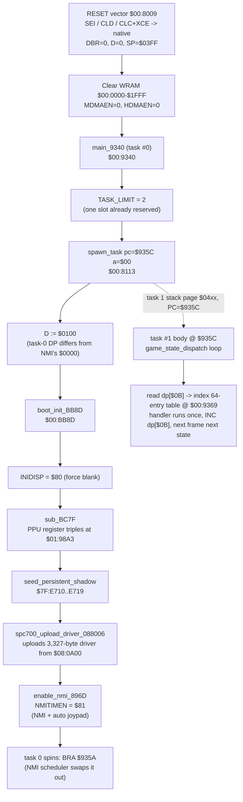
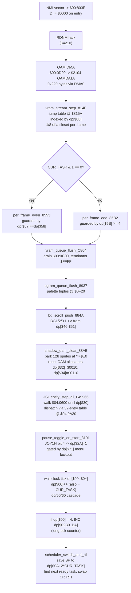
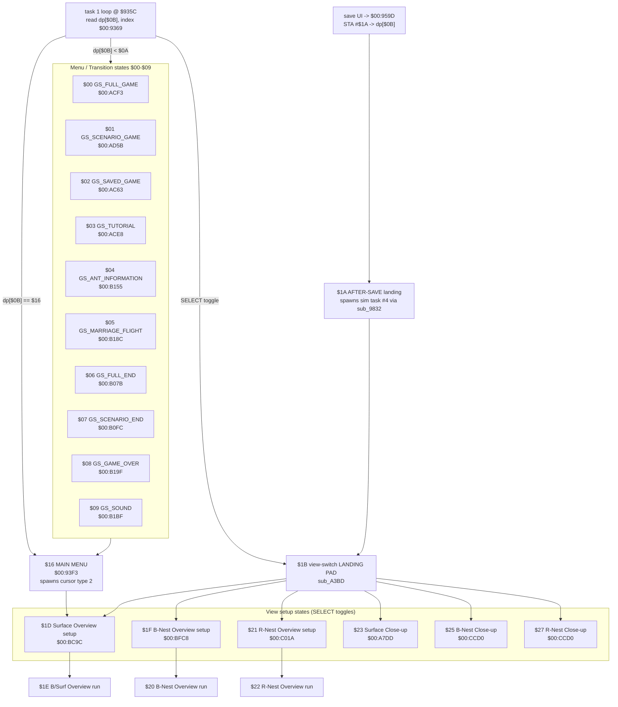
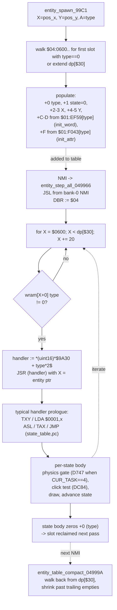
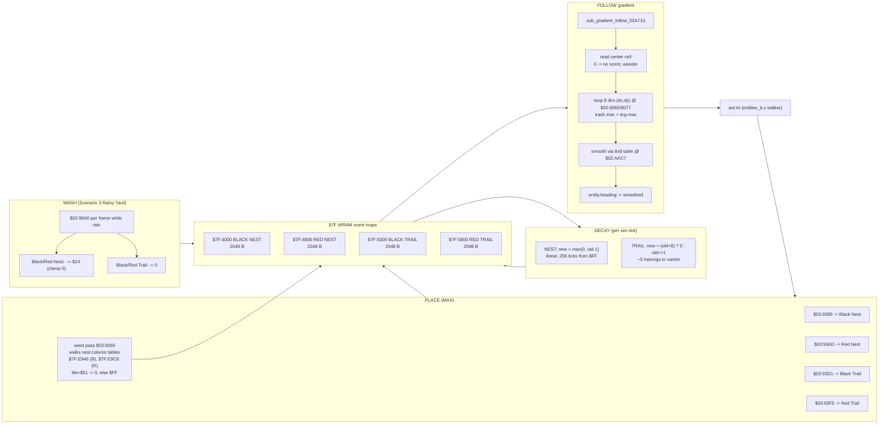
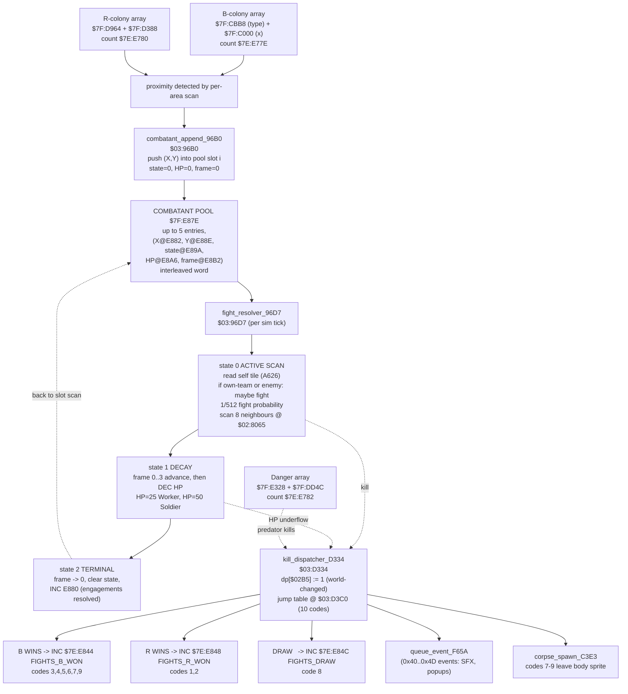
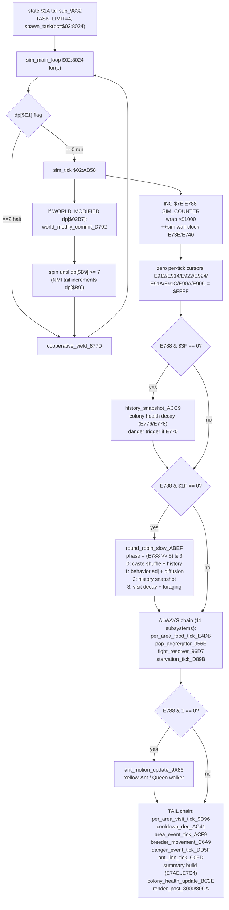
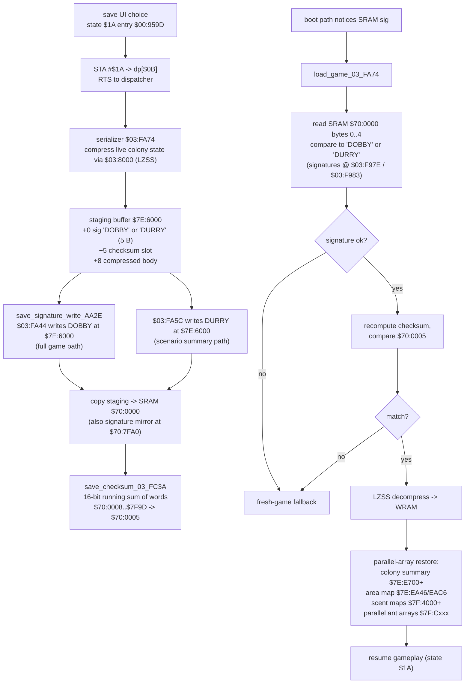
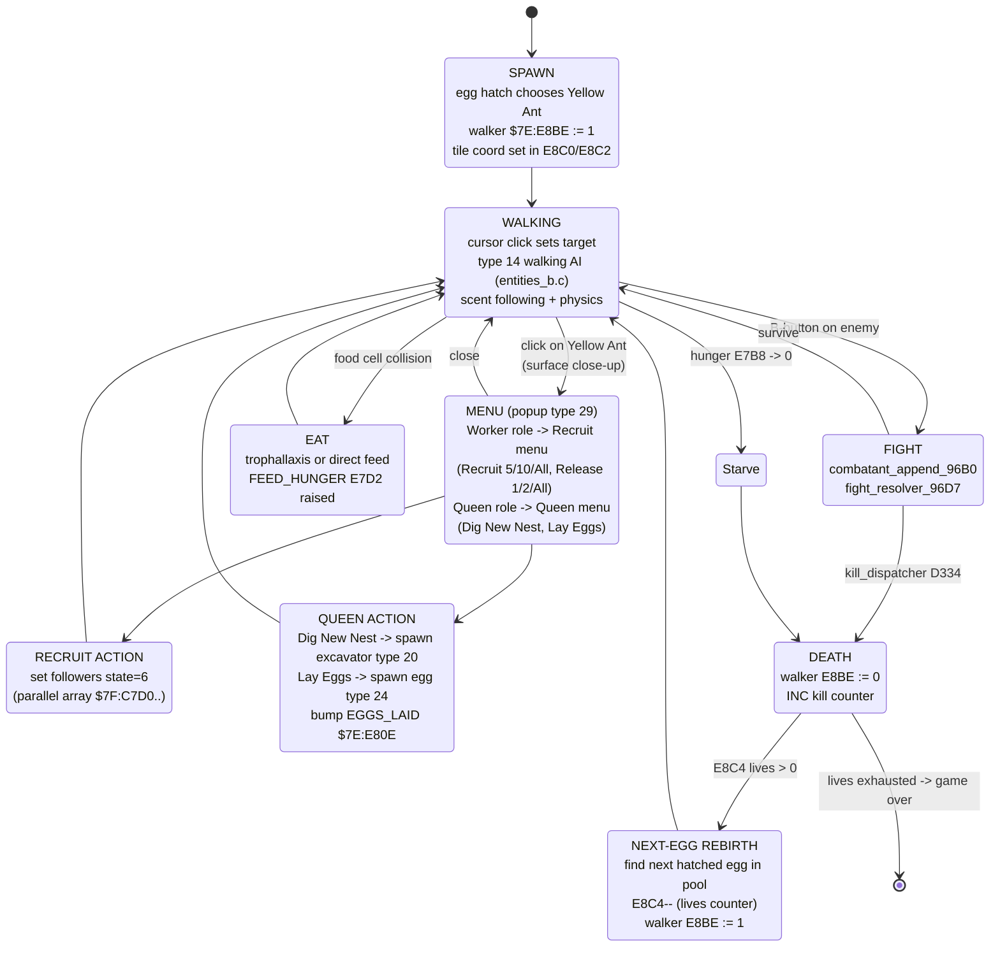
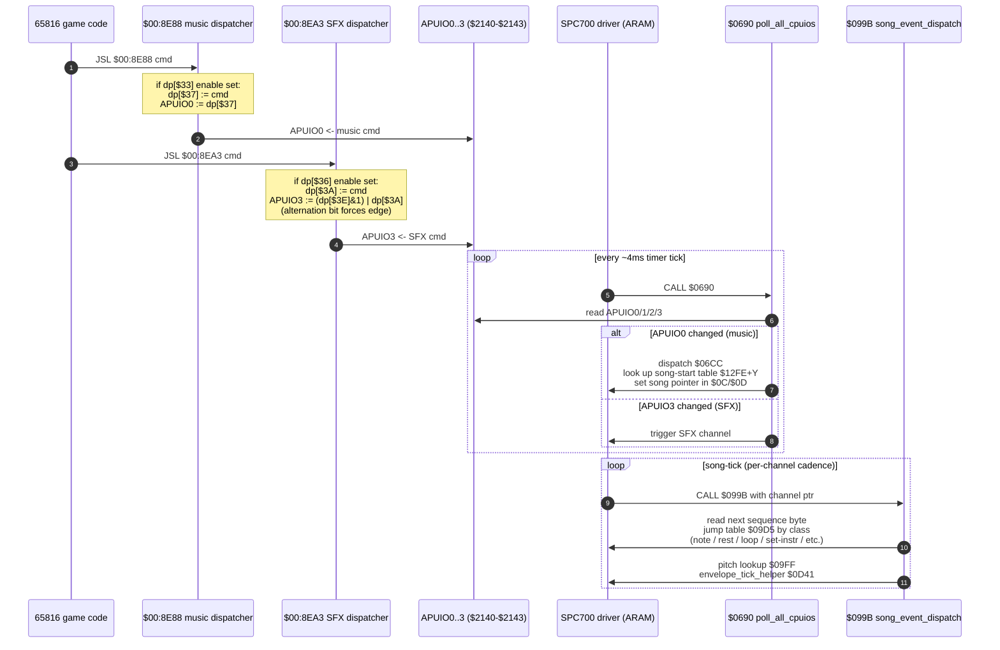

# V4-5 — SimAnt SNES Architectural Diagrams

Mermaid diagrams produced from the lifted decomp in this tree. Source files
referenced: `simant.c`, `simulation.c`, `scent.c`, `combat.c`,
`entities_b.c`, `states_gameplay.c`, `states_menu.c`, `save_options.c`,
`audio_driver.c`, `misc_helpers.c`, `player_actions.c`, plus
`README.md`, `COVERAGE.md`, `ENTITIES.md`, `PORTING.md`.

Conventions: ROM addresses in `$bank:offset`; WRAM in `$7E/$7F:offset`;
direct-page (DP) in `dp[$xx]`.

---

## 1. Boot flow

From RESET vector at `$00:8009` through `main_9340` (task 0),
`boot_init_BB8D`, the SPC700 upload, NMI enable, and the spawn of task 1
which becomes the game-state dispatcher. After init, task 0 idles
forever and the NMI's cooperative scheduler runs the dispatcher.

---

## 2. NMI handler flow

The NMI vector targets `$00:803E`. It is the entire render+scheduler
heartbeat: every frame it pushes shadow OAM via DMA, streams 1/8 of a
tileset to VRAM, flushes the queues, walks the entity table, ticks the
wall clock, then switches stacks to the next ready task and RTIs.

---

## 3. Game-state dispatcher

`dp[$0B]` is the master game-state index into a 64-entry table at
`$00:9369`. Most handlers run **once** and `INC dp[$0B]` to advance. The
SELECT button branches into a family of view-switch states
($1D/$1F/$21/$23/$25/$27), the main menu lives at $16, and the save
flow lands back at $1A after the serializer.

---

## 4. Entity lifecycle

Entities are 20-byte records at `$04:0600`. `entity_spawn_99C1` finds a
free slot and copies per-type init constants from ROM tables. Every NMI
the walker at `entity_step_all_049966` dispatches each live entity to
its handler via the 32-entry table at `$04:9A30`; most handlers then
dispatch on byte +1 (state) through a per-type indirect JMP table.

---

## 5. Scent system

Four 2048-byte maps at `$7F:4000-$7F:5FFF` (64x32 cells, 32x32 px each).
Place uses MAX semantics, decay differs between nest (linear) and trail
(exponential halving), follow scans 8 compass neighbours and smooths via
an 8x8 table at `$02:AAC7`, rain (Scenario 3) weakens nest by $14 and
zeros trail entirely.

---

## 6. Combat flow

Two ant tables exist: the visual entity pool at `$7E:0600` and the
abstract per-colony parallel arrays at `$7F:C000..$7F:E328`. Active
fighters get pushed into the combatant pool at `$7F:E87E` (max 5
entries). `fight_resolver_96D7` ticks each combatant per sim_tick, and
all kill outcomes funnel through `kill_dispatcher_D334` which bumps
`E844` (B wins), `E848` (R wins), or `E84C` (draws).

---

## 7. Simulation tick

Task #4 (spawned from gameplay state `$1A` via `sub_9832`) is the
simulation task. It calls `sim_tick` (`$02:AB58`) once and then waits
~7 NMIs (`dp[$B9] < 7`), giving ~8.5 Hz. Each call advances master
counter `$E788`, runs 11 always-subsystems, ant motion every 2 ticks,
the 4-way slow round-robin every 32 ticks, and colony health decay
every 64 ticks.

---

## 8. Save / load flow

Game-state $1A is the save landing pad. The save UI sets `dp[$0B]=$1A`
(at `$00:959D`), serializer entry compresses live WRAM into the staging
buffer at `$7E:6000`, writes either "DOBBY" (full game) or "DURRY"
(scenario summary) signature, copies to SRAM `$70:0000`, then writes a
16-bit checksum at `$70:0005` via `$03:FC3A`. Load mirrors it: signature
match -> decompress -> parallel-array restore.

---

## 9. Yellow Ant lifecycle

The Yellow Ant is the player avatar — a *composite* across cursor
entities (types 1/2), the visual ant body (Worker type 14 or Queen
type 18), and the abstract walker tracker at `$7E:E8BE..E8C6`. Menu
actions (Recruit / Queen popups, type 29) and player attack flow
through `player_actions.c`. On death (hunger=0 or fight loss) the next
egg rebirth bumps the lives counter at `$7E:E8C4`.

---

## 10. Audio command path

Game code never talks to the SPC700 directly. It calls one of two
front doors: `apu_send_music_8E88` (writes `dp[$37]` to APUIO0 if music
enabled `dp[$33]`) or `apu_play_sfx_8EA3` (writes `dp[$3A]` to APUIO3
with an alternating bit `dp[$3E]&1` so the SPC700 always sees a state
change, gated by `dp[$36]`). The SPC700 driver polls APUIO0..3 every
4 ms tick at `$0690`, dispatches the byte, and routes music bytes
through the song-event interpreter at `$099B`.

