# 01 — Architecture: Boot, NMI, Scheduler, State Machine

This page documents how the SimAnt SNES cart wakes up, schedules work, and
walks the player from RESET into the title screen and gameplay. Three
distinct timing layers cooperate:

1. **RESET / boot init** — runs once on power-on.
2. **NMI handler** — runs every vertical retrace (~60 Hz NTSC).
3. **Cooperative task scheduler** — multiplexes up to 8 "tasks" onto the
   NMI; each one resumes via SP-swap-then-RTI.

The visible game state machine (dp[$0B]) sits on top of all three. It is
just a 68-entry dispatch table whose entries are picked once per loop of
task #1.

For the per-tick colony update, see
[02 — Simulation Tick](02-simulation-tick.md). For the random number
generator that feeds entity AI, see [03 — RNG](03-rng.md).

Manual cross-reference: page 4 ("Getting Started" — the boot path is what
happens between INSERT CART and the title screen). The author credit
"Will Wright" is hardcoded at ROM $01:93E0 (visible in the title-screen
text table).

---

## 1. RESET path — `$00:8009`

The native-mode RESET vector at `$00:FFFC` points to `$00:8009`. The
boot code does three things in order:

1. Switch to native mode (`CLC / XCE`), disable IRQs, clear decimal mode.
2. Zero WRAM banks `$7E:0000..1FFF` (8 KB).
3. Set SP = `$03FF`, then `JMP $9340`.

See `simant.c:380` for the C model:

```c
void reset(void)
{
    /* SEI, CLD, CLC+XCE => native mode. DBR=0, D=0. */
    MDMAEN = 0;
    HDMAEN = 0;
    for (unsigned i = 0; i < 0x2000; ++i) wram[i] = 0;
    /* SP = $03FF. JMP $9340. */
    main_9340();
}
```

---

## 2. `main_9340` — the boot driver

Task 0's body (`simant.c:407`). It is responsible for:

1. Setting `TASK_LIMIT = 2` (one task currently running, one about to be
   spawned).
2. Spawning task #1 at `$00:935C` via `spawn_task` (`$00:8113`).
3. Setting D = `$0100` so that task 0's ZP loads target `wram[$0100..]`
   instead of `wram[$0000..]` — important to know if you ever inspect
   task 0's stack.
4. `CLI` to unmask IRQs (defensive — NMI is the real driver).
5. `JSR $BB8D` → `boot_init_BB8D`: PPU bring-up, SPC700 driver upload,
   per-game shadows in `$7F:E710+`.
6. `JSR $896D` → `enable_nmi_896D`: write `$81` to NMITIMEN (NMI on +
   joypad auto-read).
7. `BRA $935A` — idle forever; the scheduler's RTI will yank execution
   between this and task 1 every 60 Hz.

```c
static void main_9340(void)
{
    TASK_LIMIT = 2;
    spawn_task(/*pc=*/0x935C, /*a=*/0x00);
    boot_init_BB8D();
    enable_nmi_896D();
    for (;;) ;
}
```

`spawn_task` itself (`simant.c:358`) is a synthetic-interrupt-frame
builder: it pushes PBR / PC / P / X / Y / A / B / D onto a fresh stack
page (`$03FF`, `$04FF`, `$05FF`, …) so the scheduler's eventual `RTI`
lands at the task's entry PC with a defined register set.

---

## 3. NMI handler — `$00:803E`

Vector: `$00:FFEA → $803E`. The handler runs every vblank (~60 Hz NTSC,
~50 Hz PAL — SimAnt's USA cart is NTSC). It performs a fixed
per-frame pipeline:

```c
/* See wiki/01-architecture.md "NMI Handler" section */
void nmi(void)
{
    (void)RDNMI;                              /* acknowledge */

    /* Shadow OAM DMA: 0x220 bytes from $00:0D00 -> $2104. */
    DMA0_PARAM = 0x00;  DMA0_DEST  = 0x04;
    DMA0_SRC   = 0x0D00; DMA0_BANK  = 0x00;
    DMA0_LEN   = 0x0220; MDMAEN     = 0x01;

    vram_stream_step_814F();                  /* one of 8 VRAM blocks  */
    if ((CUR_TASK & 1) == 0) per_frame_even_8553();
    else                     per_frame_odd_85B2();

    vram_queue_flush_C804();                  /* user-queued VRAM      */
    oam_index_reset_8937();                   /* CGRAM palette flush   */
    bg_scroll_push_884A();                    /* BG1/2/3 scroll        */
    shadow_oam_clear_88A5();                  /* park sprites off-screen */
    entity_step_all_049966();                 /* run all live entities */
    pause_toggle_on_start_8101();             /* START -> dp[$2A] = 1  */

    /* Wall clock at dp[$00..$04]. dp[$00] is also CUR_TASK. */
    dp[0x00]++;
    /* ... 60-Hz seconds/minutes/hours cascade ... */

    scheduler_switch_and_rti();               /* SP-swap + RTI         */
}
```

The full body is at `simant.c:449`. Key invariants:

- **OAM DMA first.** The shadow OAM at `$00:0D00` is 0x220 bytes and gets
  pushed in one MDMAEN burst before anything else touches the bus.
- **Single VRAM block per frame.** `vram_stream_step_814F` indexes a jump
  table at `$815A` by `2 * dp[$88]`. Each entry transfers 2 KB to a fixed
  VRAM destination; index 0 is a bare RTS so the streamer can be paused.
- **Entity walker pinned to NMI.** `entity_step_all_049966` (`simant.c:668`)
  walks `$04:0600` until `dp[$30]`, dispatching each entity through the
  118-entry table at `$04:9A30`. See [gaps.c handler table](../gaps.c).
- **Wall clock** at `dp[$00..$04]` ticks at 60 Hz. `dp[$00]` doubles as
  `CUR_TASK` — when it rolls past 4 (once every 256 frames) the long-tick
  counter at `dp[$02B9..$02BA]` is bumped.

---

## 4. Cooperative task scheduler

The scheduler is built directly into the NMI tail at `$00:80D0..$00:8100`.
It is an 8-slot round-robin with per-task countdown.

Task table layout (interleaved through DP):

| DP slot     | Purpose                       |
|-------------|-------------------------------|
| `dp[$0A+2i]`| Saved SP for task i           |
| `dp[$12+2i]`| Reload countdown              |
| `dp[$1A+2i]`| Current countdown             |
| `dp[$22+2i]`| Enable flag (non-zero = run)  |

`CUR_TASK = dp[$00]`, `TASK_LIMIT = dp[$02]` (in bytes — i.e. `2 *
task_count`).

The NMI tail logic:

```asm
; Save interrupted task's SP
STX dp[$0A + 2*CUR_TASK]

; Find next runnable slot
loop:
  CUR_TASK = (CUR_TASK + 2) mod TASK_LIMIT
  if not enabled: continue
  countdown[CUR_TASK] -= 1
  if countdown == 0:
      countdown = reload
      TSX  ; switch to new task's SP
      RTI  ; pop PC and status from new stack
  ; else fall through, try next slot
```

The effect: each task runs on its own stack page (`$03xx`, `$04xx`, …)
and is "preempted" only by NMI. Between NMIs each task runs without
interruption.

`spawn_task` at `simant.c:358` lays out the synthetic stack frame. The
scheduler's RTI sequence expects (bottom → top of stack):

```
PBR (caller A)  PC (caller X)  P  X  Y  A  B  D
```

---

## 5. Game state machine — dp[$0B] and the dispatch table

Task #1's body lives at `$00:935C` and is a straight infinite loop:

```c
/* See wiki/01-architecture.md "Game State Machine" section */
static void game_state_dispatch_935C(void)
{
    for (;;) {
        unsigned s = dp[0x0B];
        if (s < 68 && dispatch[s])
            dispatch[s]();
    }
}
```

The dispatch table at `$00:9369` is **68 entries** (not 10 — that was
the earliest lift's guess). Each handler is **run-once**: it sets up its
screen (palette + tilemap + sprite OAM), then `INC dp[$0B]` so the
**next** iteration of the loop picks up the following state.

Reference (`simant.c:179`) for the first 10 named states:

```c
enum GameState {
    GS_FULL_GAME       = 0, GS_SCENARIO_GAME   = 1, GS_SAVED_GAME    = 2,
    GS_TUTORIAL        = 3, GS_ANT_INFORMATION = 4, GS_MARRIAGE_FLIGHT=5,
    GS_FULL_END        = 6, GS_SCENARIO_END    = 7, GS_GAME_OVER     = 8,
    GS_SOUND           = 9,
    GS_AFTER_SAVE      = 0x1A,  /* the save-game commit lands here */
};
```

State `$1A` (`GS_AFTER_SAVE`) is where the simulation task (#4) is
spawned via `sub_9832` — see
[02 — Simulation Tick](02-simulation-tick.md).

---

## 6. Boot flow diagram

```mermaid
flowchart TD
    A[Power on / RESET vector $FFFC] --> B["$00:8009 reset()"]
    B --> C["clear WRAM $0000-$1FFF<br/>SP=$03FF, native mode"]
    C --> D["JMP $9340 (main_9340)"]
    D --> E["TASK_LIMIT = 2"]
    E --> F["spawn_task pc=$935C<br/>(task #1 = game-state dispatch)"]
    F --> G["JSR $BB8D<br/>boot_init: PPU, SPC700 upload, shadows"]
    G --> H["JSR $896D<br/>NMITIMEN = $81 (NMI + joypad AR)"]
    H --> I["BRA $935A — task 0 idles forever"]
    I -. "NMI 60Hz" .-> J["$803E nmi()"]
    J --> K["OAM DMA -> VRAM stream -><br/>scroll push -> entity walker -><br/>clock tick"]
    K --> L["scheduler: SP-swap to next<br/>task with countdown==0; RTI"]
    L -. "first NMI" .-> M["Task #1 resumes at $935C"]
    M --> N["dp[$0B] = 0<br/>GS_FULL_GAME handler"]
    N --> O["fades, asset DMA, INC dp[$0B]"]
    O --> P["title menu / scenario picker"]
    P -. "user picks scenario" .-> Q["dp[$0B] = $1A<br/>GS_AFTER_SAVE"]
    Q --> R["sub_9832 spawns task #4<br/>= sim_main_loop_028024"]
    R -. "see 02-simulation-tick.md" .-> S[("colony tick<br/>8.5 Hz")]
```



---

## 7. Inline pointers

Code annotations referencing this page:

- `simant.c:nmi` — "See wiki/01-architecture.md NMI Handler section"
- `simant.c:main_9340` — "See wiki/01-architecture.md main_9340 section"
- `simant.c:game_state_dispatch_935C` — "See wiki/01-architecture.md
  Game State Machine section"

---

## 8. Manual references

- **Page 4 — "Getting Started"**: the player flow from cart insertion
  through title screen is exactly what the boot-init + first few state
  handlers (`GS_FULL_GAME`, `GS_SAVED_GAME`, `GS_TUTORIAL`,
  `GS_SOUND`) implement.
- **Will Wright credit** at `$01:93E0` — visible string in ROM
  (extracted by `dig.py`); appears on the title screen via the
  `GS_FULL_GAME` template.

What the manual does NOT say but the code reveals:

- The 60 Hz heartbeat hides a **cooperative scheduler** running up to
  eight independent tasks on separate stack pages. This is what makes
  the simulation tick (next page) run "in parallel" with rendering.
- The game-state machine has **68 entries**, not the 10 named ones —
  the unnamed ones are gameplay-mode states (one per view + various
  transient screens).
