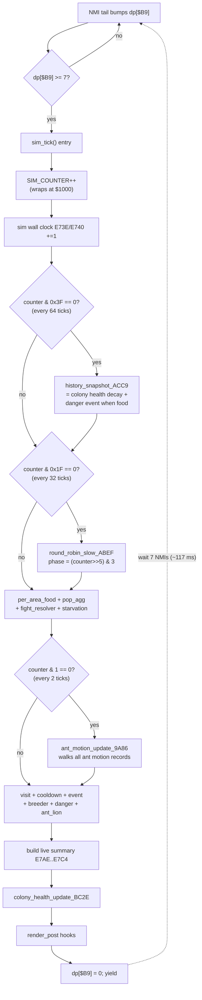

# 02 — Simulation Tick: the 8.5 Hz colony heartbeat

Where the [architecture](01-architecture.md) page covered per-frame
rendering, this page covers what happens **between frames**: the
colony-wide bookkeeping that gives SimAnt its "alive" feel. None of
this is described in the manual — it is a fully internal subsystem.

The tick is driven by **task #4** (`sim_main_loop` at `$02:8024`),
spawned during state `$1A` (`GS_AFTER_SAVE`). Like the other tasks, 
it sits on its own stack page and is preempted only by NMI. Unlike the
other tasks, it self-throttles: each iteration calls `sim_tick()` once,
then spins until `dp[$B9] >= 7` — i.e. until seven NMIs have elapsed.

## Why 8.5 Hz?

This is a derived fact (not in the manual, not in any comment in the
original ROM):

- SNES NMI fires every `1 / 60.0988` s ≈ 16.64 ms (NTSC).
- The sim task waits for `dp[$B9] >= 7` before each tick.
- `dp[$B9]` is bumped by the scheduler tail (once per NMI per task slot).
- Net pace: one tick every 7 frames ≈ **8.58 ticks per second**.

So the "fast" tick is 8.5 Hz; subsystems gated by `(SIM_COUNTER & 0x1F)`
fire at 8.5 / 32 ≈ **0.27 Hz** (every ~3.7 seconds, the "slow round
robin"); subsystems gated by `(& 0x3F)` fire at 8.5 / 64 ≈ **0.13 Hz**
(every ~7.5 seconds, colony-health decay).

## Master counter

`SIM_COUNTER` lives at `$7E:E788` (`simulation.c:216`). It is a 16-bit
counter that wraps at `$1000`:

```c
/* See wiki/02-simulation-tick.md "Master Counter" section */
void sim_tick(void)
{
    SIM_COUNTER++;
    if (SIM_COUNTER > 0x1000) SIM_COUNTER = 0;
    /* ... */
}
```

The wrap period is `$1001 = 4097` ticks ≈ 8 minutes wall clock. Mods
of this counter pick the "phase" of every subsystem below.

The sim wall clock is a separate 32-bit pair at `$E73E..$E741`,
incremented every tick (16-bit increment with carry into the high word).

---

## The tick chain — `sim_tick()` at `$02:AB58`

The body is faithfully ported in `simulation.c:498`. Every tick runs the
following pipeline in order:

```c
/* See wiki/02-simulation-tick.md "Tick Chain" section */
void sim_tick(void)
{
    SIM_COUNTER++;
    if (SIM_COUNTER > 0x1000) SIM_COUNTER = 0;
    if (++WMEM16(0xE73E) == 0) WMEM16(0xE740)++;

    /* reset 8 entity-cursor scratch slots to $FFFF */
    /* ... */

    if ((SIM_COUNTER & 0x3F) == 0) history_snapshot_ACC9();   /* /64 */
    if ((SIM_COUNTER & 0x1F) == 0) round_robin_slow_ABEF();   /* /32 */

    per_area_food_tick_E4DB();    /* every tick */
    pop_aggregator_956E();
    fight_resolver_96D7();
    starvation_tick_D89B();

    if ((SIM_COUNTER & 0x01) == 0) ant_motion_update_9A86();  /* /2 */

    per_area_visit_tick_9D96();
    cooldown_dec_AC41();
    area_event_tick_ACF9();
    breeder_movement_C6A9();
    danger_event_tick_DD5F();
    ant_lion_tick_C0FD();
    /* ... build live summary block $E7AE..E7C4 ... */
    colony_health_update_BC2E();
    if (PLAY_MODE == 0) render_post_80CA();
    render_post_8000();
}
```

### Per-tick (8.5 Hz) phase

These run on **every** sim tick (`simulation.c:539`):

| Subsystem                  | ROM addr     | Purpose                                      |
|----------------------------|--------------|----------------------------------------------|
| `per_area_food_tick_E4DB`  | `$03:E4DB`   | Update food drops in each of 49 areas        |
| `pop_aggregator_956E`      | `$02:956E`   | Roll up per-area pop counts                  |
| `fight_resolver_96D7`      | `$03:96D7`   | Resolve B-vs-R / B-vs-enemy combats          |
| `starvation_tick_D89B`     | `$03:D89B`   | Decrement food, kill hungry ants             |
| `per_area_visit_tick_9D96` | `$02:9D96`   | Per-area "currently visible" decay           |
| `cooldown_dec_AC41`        | `$02:AC41`   | Decrement event cooldowns                    |
| `area_event_tick_ACF9`     | `$02:ACF9`   | Trigger area events (Marriage Flight, etc.)  |
| `breeder_movement_C6A9`    | `$02:C6A9`   | Move winged breeders toward swarm sites      |
| `danger_event_tick_DD5F`   | `$02:DD5F`   | Tick active dangers (hand, cat, bicycle, …)  |
| `ant_lion_tick_C0FD`       | `$03:C0FD`   | Per-scenario ant lion (the trap predator)    |
| `colony_health_update_BC2E`| `$03:BC2E`   | Recompute colony grade / status              |
| `render_post_8000/80CA`    | `$04:8000+`  | Sprite-table rebuild hooks                   |

### Every 2 ticks (~4.25 Hz)

`ant_motion_update_9A86` (`$03:9A86`) at `simulation.c:546`. This is the
big one — it walks the per-ant motion records and applies one move step
to each active ant. The Yellow Ant avatar also rides this slot (see
[gaps.c:120+](../gaps.c) for the walker record at `$7E:E8BE`).

### Every 32 ticks (~0.27 Hz)

`round_robin_slow_ABEF` (`simulation.c:668`) cycles through 4 phases:

```c
unsigned phase = (SIM_COUNTER >> 5) & 0x03;
switch (phase) {
case 0:
    slow_subsys_80BD();          /* caste shuffler + worker burst */
    pop_summary_923B();          /* $02:923B */
    hist_post_9419();            /* % display refresh */
    slow_subsys_F927();          /* HISTORY GRAPH SNAPSHOT */
    break;
case 1:
    slow_subsys_812F();          /* Behavior Panel adjust */
    slow_subsys_9269();          /* per-area pop diffusion */
    slow_subsys_931B();
    slow_subsys_934B();
    break;
case 2:
    pop_summary_923B();
    hist_post_9419();
    slow_subsys_F927();          /* HISTORY GRAPH SNAPSHOT (2nd) */
    break;
case 3:
    slow_subsys_81A1();          /* Caste Panel adjust */
    slow_subsys_92C2();          /* area visit/decay */
    slow_subsys_9333();
    slow_subsys_936A();
    break;
}
```

Phase 0 and phase 2 both push a history-graph sample, but **each
phase only fires once per 4-step round** (i.e. once per 128 sim-ticks),
not on every slow-tick. The two pushes are offset by 64 ticks within a
128-tick round, so the *effective* push rate is **one sample per 64
sim-ticks** — ≈ 64 / 8.58 Hz ≈ **7.45 seconds per sample**. The
64-entry circular buffer at `$7E:F6D7..$7E:FBD7` therefore covers
about **8 minutes** of colony history before it laps — almost exactly
one full `SIM_COUNTER` cycle. (Earlier wiki drafts claimed "≈ 2 minutes"
by mistakenly counting each round-robin call as a push; the round-robin
itself fires every 32 ticks but only ¼ of those calls land in a
history-pushing phase.)

### Every 64 ticks (~0.13 Hz)

`history_snapshot_ACC9` (`simulation.c:613`) — misnamed in the lifted
file; the actual job is **colony-health decay**, not history sampling:

```c
static void history_snapshot_ACC9(void)
{
    if (POP_ALIVE_FLAG_4C == 0) {
        if (COLONY_B_HEALTH > 0) COLONY_B_HEALTH--;
    }
    if (COLONY_R_HEALTH > 0) COLONY_R_HEALTH--;

    /* Danger-event trigger: fire when food < danger budget */
    int fire = ((int16_t)TOTAL_FOOD < 0) || (TOTAL_FOOD < DANGER_BUDGET);
    if (fire) {
        slow_8E06(0x96, 1);              /* spawn "Hand" enemy event */
        DANGER_BUDGET = DANGER_BUDGET_RST;
    }
}
```

This is the passive "ants die slowly without food" decay. A starving
colony loses 1 health every 7.5 seconds — so a colony at full health
(100) has about **12 minutes** of starvation runway before it falls
to 0. The danger-event trigger is what fires enemies like the Hand
(manual p.32) when food runs out.

---

## Per-tick flow diagram



---

## Why the sim runs in its own task

Putting the sim on its own cooperative-task slot has two benefits the
ROM authors clearly cared about:

1. **The renderer never blocks on simulation.** If a tick takes longer
   than 117 ms (rare but possible during marriage flight setup), the
   render task still gets its 60 Hz NMI slot — the screen never tears.
2. **The 7-frame budget is a soft cap.** Subsystems can use the full
   inter-NMI window for one task without starving others. The scheduler
   reasserts itself every NMI.

The "8.5 Hz" choice is also a clever bit of design: it is fast enough
to feel responsive (an ant that turns left will visibly turn within
~120 ms) but slow enough that the 49-area map sweeps remain cheap. With
49 areas × 8.5 sweeps/sec = ~417 area-ticks/sec, the 65C816 has cycles
to spare.

---

## Inline pointers

Code annotations referencing this page:

- `simulation.c:sim_main_loop_028024` — "See
  wiki/02-simulation-tick.md Master Counter section"
- `simulation.c:sim_tick` — "See wiki/02-simulation-tick.md Tick Chain
  section"
- `simulation.c:round_robin_slow_ABEF` — "See
  wiki/02-simulation-tick.md slow phase section"

---

## What the manual covers vs. what this page adds

**Manual page 19** ("Expanding"): says the Marriage Flight happens when
the colony has ≥100 ants and ≥20 breeders. That trigger lives in
`marriage_flight_trigger_9E35` (`simulation.c:754`), called from
**phase 0** of the slow round-robin — so it is evaluated every
~7.5 seconds, not every frame.

**Manual page 19** ("Mass Exodus"): says ants flee when an area reaches
250. That cap is enforced in `mass_exodus_cap_and_split_F050`
(`simulation.c:785`), called from the per-tick `pop_aggregator_956E` —
so it is evaluated every ~117 ms.

**Not in the manual**:

- The 8.5 Hz tick rate itself, and the 7-frame `dp[$B9]` wait gate.
- The four-phase slow round-robin and its 0.27 Hz cadence.
- Colony-health decay at one point per ~7.5 seconds.
- The 12-minute starvation runway (a derived consequence of the above).
- The fact that the simulation **runs in its own task** and is therefore
  decoupled from rendering — most players never notice but it is what
  prevents long simulation sweeps from causing visible stutter.
- The history graph's effective ~7.5-second sample period and ~8-minute
  full-buffer lap time.
