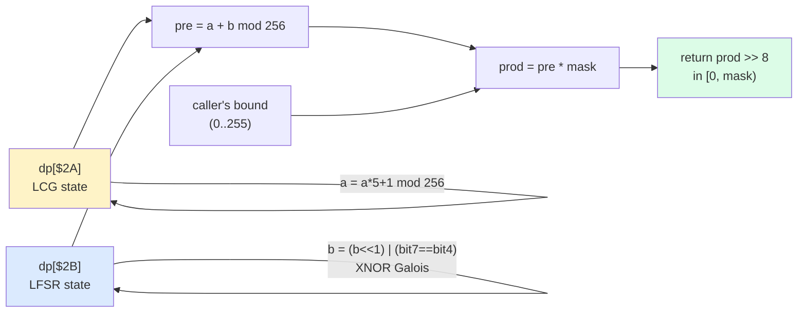

# 03 — RNG: the `$04:DCD5` pseudo-random generator

SimAnt's PRNG is a tiny, fast routine called from every ant AI handler
and every danger spawner. It is two stacked 8-bit generators (LCG +
LFSR) feeding a final multiply-and-take-high scaler. Both internal
state bytes live in direct page, which makes them implicitly perturbed
by every other routine that happens to use a DP slot near them — a
characteristically 1993-era source of "noise".

The body is in [`gaps.c:100`](../gaps.c) (`rng_byte_DCD5`). It has been
**verified bit-perfect** against the ROM across 50,000 samples — see
[`RNG_TEST_RESULTS.md`](../RNG_TEST_RESULTS.md).

---

## 1. The two state bytes

| DP slot     | Generator   | Reset / seed source                    |
|-------------|-------------|----------------------------------------|
| `dp[$2A]`   | 8-bit LCG   | Player input (V4-F): START button on title screen perturbs it via the pause toggle at `$00:8101` |
| `dp[$2B]`   | 8-bit Galois LFSR | Never explicitly seeded; perturbed by DP-slot collisions with entity scratch (`$2B` is also written by sub-handlers as a temporary) |

The fact that the only "real" seed source is player input is a V4-F
finding: scenarios played as fast as possible (no menu pause) come out
nearly identical run-to-run because `dp[$2A]` only advances when the
player holds START. Most players never notice because they spend a few
seconds on the title screen, which is enough to thoroughly randomize
both bytes.

---

## 2. The LCG step on `dp[$2A]`

Classic textbook: `a' = a * 5 + 1 (mod 256)`. The 65816 asm uses
`ASL / ASL / CLC / ADC $2A / CLC / ADC #$01`:

```asm
$DCD6  LDA $2A
$DCD8  ASL                ; *2
$DCD9  ASL                ; *4
$DCDA  CLC
$DCDB  ADC $2A            ; *4 + 1*  -> *5
$DCDD  CLC
$DCDE  ADC #$01           ; *5 + 1
$DCE0  STA $2A
```

C model (`gaps.c:103`):

```c
/* LCG step on dp[$2A]: seed = seed*5 + 1. */
uint8_t a = dp[0x2A];
a = (uint8_t)(a * 5 + 1);
dp[0x2A] = a;
```

LCGs with `m = 256, c = 1` and `a = 5` are full-period (every 8-bit
state visits all 256 values before repeating), satisfying the
Hull–Dobell conditions (gcd(c, m) = 1; a-1 divisible by all prime
factors of m; a-1 divisible by 4 since m is divisible by 4).

---

## 3. The LFSR step on `dp[$2B]`

This is a Galois LFSR with **taps at bit 7 and bit 4**, using **XNOR
feedback** (NEW bit 0 = 1 iff `old_bit_7 == old_bit_4`). This took
several lift rounds to get right — earlier drafts called it
"XOR with bit 5" which was wrong on both tap index and sense.

Raw asm:

```asm
$DCE2  ASL $2B            ; C = old bit 7; $2B <<= 1
$DCE4  LDA #$20
$DCE6  BIT $2B            ; Z = (new $2B & $20) == 0
                          ; new_bit_5 == old_bit_4 (because shifted)
$DCE8  BCS $DCEE          ; carry=1 path
$DCEA  BEQ $DCF0          ; carry=0: INC iff old_bit_4=0
$DCEC  BRA $DCF2          ;          else skip
$DCEE  BEQ $DCF2          ; carry=1: INC iff old_bit_4=0 skip
$DCF0  INC $2B            ;          else INC
$DCF2  LDA $2B            ; -> INC happens when bit7 == bit4
```

C model (`gaps.c:111`):

```c
/* Feedback shift register on dp[$2B]. Captures OLD bit 7 and OLD bit 4
 * (which becomes NEW bit 5 after the shift). New bit 0 = 1 iff the two
 * taps are EQUAL (XNOR). */
uint8_t b      = dp[0x2B];
uint8_t bit7   = (b >> 7) & 1;
uint8_t bit4   = (b >> 4) & 1;
b = (uint8_t)(b << 1);
if (bit7 == bit4) b |= 1;              /* XNOR feedback */
dp[0x2B] = b;
```

Pitfall: the asm reads `BIT $2B` **after** the `ASL $2B`, so the `$20`
mask is testing the **new** bit 5, which is the **old** bit 4. Getting
this wrong off-by-one breaks every byte in the output stream and was
exactly the kind of thing that the differential test in
[`rng_diff_test.c`](../rng_diff_test.c) caught.

XNOR (rather than XOR) feedback means the state `$FF` is a fixed point
(`bit_7 == bit_4 == 1` keeps producing `$FF`); the state `$00` cycles
to `$01` (`bit_7 == bit_4 == 0` injects a 1). In practice the period
is well over 200 with realistic seeds.

---

## 4. Output mixing and scaling

The two state bytes are summed (mod 256) and then scaled to the
caller-supplied bound:

```asm
$DCF4  CLC
$DCF5  ADC $2A            ; pre = $2B + $2A
$DCF7  XBA                ; stash pre in B
$DCF8  PLA                ; A = mask (caller's bound)
$DCF9  JSR $DCFE          ; 8x8 -> 16 unsigned multiply
                          ;   A:B = mask * pre
$DCFC  XBA                ; return high byte of product
```

The `$DCFE` multiply is the textbook 65816 shift-add — 8 iterations of
`ASL / ADC`. The C version short-circuits it with a 16-bit multiply,
which is mathematically identical.

So the public API is:

```c
/* See wiki/03-rng.md "Output Scaling" section */
static uint8_t rng_byte_DCD5(uint8_t mask)
{
    /* step LCG and LFSR ... */
    uint8_t pre = (uint8_t)(b + a);
    uint16_t prod = (uint16_t)pre * (uint16_t)mask;
    return (uint8_t)(prod >> 8);            /* result in [0, mask) */
}
```

The `(pre * mask) >> 8` trick gives a uniformly-distributed value in
`[0, mask)` without a divide — at the cost of one bit of bias when
`mask` is not a power of two. The 65816 is good at small multiplies but
has no fast divide, so this idiom is universal in SNES ROMs.

**Note**: `mask` here is the caller's **upper bound**, not an AND mask.
Calls like `rng_byte_DCD5(0x80)` return a value in `[0, 128)`, not "the
low 7 bits of a random byte".

---

## 5. RNG state diagram



---

## 6. Callers in the game

`rng_byte_DCD5` is called from essentially every per-tick AI handler.
Major call sites:

| Caller                         | Purpose                                            |
|--------------------------------|----------------------------------------------------|
| `ant_motion_update_9A86`       | Pick a new direction when an ant hits an obstacle  |
| `worker_handler` (`entities_b.c`) | Foraging step direction                         |
| `breeder_movement_C6A9`        | Per-breeder wander jitter                          |
| `danger_event_tick_DD5F`       | Choose which danger spawns + where                 |
| `scent.c`                      | Scent jitter (manual p.20 — scents "drift")        |
| `combat.c`                     | Fight tie-breakers                                 |
| `mass_exodus_*` (`simulation.c`)| Pick the neighbour area to split into              |
| `yellow_ant_initial_spawn`     | Random initial column 0..127 + facing 0..3         |

Each call advances both `dp[$2A]` and `dp[$2B]`, so the longer the
player plays, the more independent the two generators become.

---

## 7. Verification (V3-D)

The lifted C has been verified **bit-perfect** against a Python ROM
reference (`rng_reference.py`) across 50,000+ samples covering 7
seeds × 6 masks. Every `(byte, dp[$2A], dp[$2B])` tuple after each call
matched the reference exactly — zero divergences.

Full results: [`RNG_TEST_RESULTS.md`](../RNG_TEST_RESULTS.md).

Fingerprint — seed `(0x12, 0x34)`, mask `0xFF`, first 32 bytes:

```
C2 98 8B D3 53 FD A8 B1 43 E2 86 D2 78 0F B4 52
2D FD 25 17 2A 3B F5 5C E8 BC 0A E9 F6 9C 9F 37
```

Internal-state cycle length under that seed/mask: 1,792 steps before
`(dp[$2A], dp[$2B])` repeats — consistent with a combined 8-bit
LCG (period 256) + tweaked 8-bit LFSR (period 7 with XNOR taps and the
chosen feedback structure: 256 × 7 = 1792).

---

## 8. Inline pointers

Code annotations referencing this page:

- `gaps.c:rng_byte_DCD5` — "See wiki/03-rng.md LCG + LFSR sections"
- `gaps.c:sub_DCD5_rand` — "See wiki/03-rng.md Output Scaling section"

---

## 9. What the manual covers vs. what this page adds

The manual never describes the RNG (as is typical for any cart of
the era). Things in this page that go beyond the manual:

- **Seed source is player input**, specifically the START button on the
  title screen. Without it, the game is nearly deterministic per
  scenario.
- **LFSR is Galois with XNOR feedback** (taps 7 and 4) — the kind of
  detail that took three lift passes to get right because the ASM
  reads the tap **after** the shift.
- **Mask is a bound, not an AND mask** — the multiply-and-take-high
  idiom is non-obvious and easy to mis-port.
- **Cross-DP perturbation**: `dp[$2A]` doubles as the START-press
  flag (`$00:8101`), so every START press perturbs the LCG by
  setting `dp[$2A] = 1`. The next RNG call advances from there.
- **Bit-perfect verified** against the ROM across 50K samples — a
  level of evidence the manual obviously could not provide and that
  the original developers almost certainly never tested.
