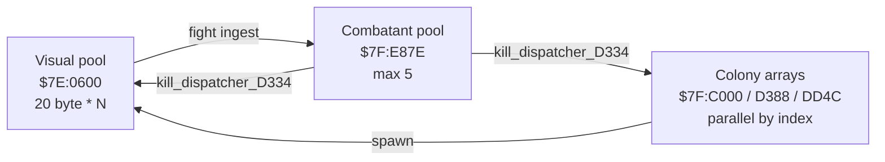

# Entity System

The SimAnt SNES engine drives every on-screen creature, marker, popup,
HUD widget and danger through a single 118-entry **entity dispatch
table** at ROM `$04:9A30`. Each entity is a fixed 20-byte record in
WRAM at `$04:0600` (mirrored at `$7E:0600`). A small spawn helper at
`$04:99C1` allocates slots; per-handler state machines drive every
behavior.

Cross-links: [Yellow Ant composite](05-yellow-ant.md),
[Pathfinding](06-pathfinding.md), full type-by-type table in
[`ENTITIES.md`](../ENTITIES.md).

Manual: p.16 ("Castes — three castes"), p.34 ("Cast of Characters").
Neither lists the entity layout — that comes entirely from the lift.

---

## 1. Entity record (20 bytes)

Decoded from `entity_spawn_0499C1` and the dispatcher prologue at
`$04:9966`. See [`simant.c`](../simant.c) line 271 for the C struct.

| Offset | Size | Field        | Notes |
|--------|------|--------------|-------|
| `+0`   | 1    | `type`       | Index into `$04:9A30` (0 = empty slot, free). |
| `+1`   | 1    | `state`      | Per-type state-machine index — drives the state JMP table. |
| `+2`   | 2    | `x`          | World X position (16-bit; raw 11-bit X plus subpixel — see entities_b.c line 25). |
| `+4`   | 2    | `y`          | World Y position. |
| `+6`   | 1    | `flag`       | Spawn zeroes it. Per-handler use (often "frame override"). |
| `+7..+B` | 5  | `scratch`    | Per-handler scratch (timers, anim phase, walk legs, etc.). |
| `+C..+D` | 2  | `init_word`  | Copied at spawn from `$01:EF59[type]` (sprite tile base / amplitude). |
| `+E`     | 1  | pad          | Zeroed at spawn. Repurposed by some handlers as facing bit. |
| `+F`     | 1  | `init_attr`  | Copied from `$01:F043[type]` (OAM-style priority+palette). |
| `+10..+13` | 4 | trail scratch | Frame timers, animation cursor, etc. |

```c
/* simant.c:271 */
typedef struct __attribute__((packed)) Entity {
    uint8_t  type; uint8_t  state;
    uint16_t x;    uint16_t y;
    uint8_t  flag; uint8_t  scratch[5];
    uint16_t init_word; uint8_t pad_e; uint8_t init_attr;
    uint8_t  pad_10; uint8_t  tail[3];
} Entity;
```

---

## 2. Dispatch table at `$04:9A30` — 118 entries

The table was previously documented as 32 entries (the visual creature
slice). V4-8 re-decoded the raw bytes from `simant.sfc` at file offset
`0x21A30` and found **118 entries**: the table runs well past `$5F`
all the way to `$71`. The "extra" indices cover scenario-specific
dangers (bicycle, hand/cat's-paw) that the previous lifts had treated
as orphans.

Status snapshot (post-Z1, 2026-05-22):

- ~110 / 118 handlers have C bodies after F/G/H rounds.
- ~8 stubs remain — notably `$3D` (bicycle, Scenario 5) and `$4B`
  (hand / cat's-paw, Scenarios 4 and 7).

Type-by-type list (handler addresses, init constants, role guesses)
lives in [`ENTITIES.md`](../ENTITIES.md). Representative handlers in
the lift:

| Range  | File                  | Representative line       |
|--------|-----------------------|---------------------------|
| `$01-$08` | [`entities_a.c`](../entities_a.c)  | line 368 (`cursor_handler_type1_9D9D`) |
| `$09-$15` | [`entities_b.c`](../entities_b.c)  | line 671 (`type14_state1_A13E_walking` — Worker walk) |
| `$16-$1F` | [`entities_c.c`](../entities_c.c)  | line 409 (`queen_state1_wander_A566`) |
| `$20-$2B` | [`entities_e.c`](../entities_e.c)  | HUD widgets, Auto/Manual icons (G2 lift) |
| `$2C-$5F` | [`entities_f.c`](../entities_f.c)  | dialog dispatchers (G3 lift) |
| `$60-$71` | [`entities_g.c`](../entities_g.c)  | late dispatchers (G4 lift) |
| Eggs `$18/$19` | [`entities_d.c`](../entities_d.c) | line 316 (`type24_state0_init_A963`) |

---

## 3. Per-state machine pattern

Every multi-state entity uses the same prologue (verified across
~30 handlers). See e.g. `entities_b.c:type14_dispatch_A112`:

```asm
TXY                   ; save entity ptr in Y
LDA #$00 / XBA        ; clear A high byte (16-bit accumulator)
LDA $0001,x           ; A = entity.state
ASL                   ; *2 (word table entries)
TAX                   ; X = state*2
JMP (state_table,pc)  ; indirect dispatch
```

The per-type state table immediately follows the JMP instruction in
ROM bank `$04`. Each entry is a 16-bit address inside bank `$04`. The
ROM never bounds-checks `state` — out-of-range values would index into
following code. The lift conservatively only dispatches known states.

Example state table (type 14 / Worker, see `entities_b.c` line 754):

```c
static void (*const type14_states[5])(Entity *) = {
    type14_state0_A128_spawn,    type14_state1_A13E_walking,
    type14_state2_A178_turning,  type14_state3_A1A7_pose,
    type14_state4_A1CC_attack,
};
```

---

## 4. Spawn helper `$04:99C1` — `entity_spawn_0499C1`

Call convention: `X = pos_x, Y = pos_y, A = type`.

1. Scan the entity table from `$0600` for the first slot whose
   `+0` byte is zero. If none, extend the watermark `dp[$30]` by 20.
2. Write `type` at `+0`; zero `state`, `flag`, `pad_e`, `pad_10`.
3. Store `pos_x` at `+2`, `pos_y` at `+4`.
4. Copy `init_word = ROM[$01:EF59 + type*2]` into `+C..+D`.
5. Copy `init_attr = ROM[$01:F043 + type]` into `+F`.

Both init tables in ROM bank `$01` are 118 entries long (parallel to
the dispatch table). See [`simant.c`](../simant.c) lines 291-292.

Aliases observed (same handler used for different in-game characters):

- type `$13` = `$12` — Queen handler reused as Snail in Scenario 6.
- type `$15` = `$10` — Worker / Caterpillar variant.
- type `$16` = `$0A` — colony color variant.

---

## 5. Walker — `$04:9966`

`sub_entity_walker_049966` iterates the table from `$0600` until
`X >= dp[$30]`, in 20-byte strides. For each slot with `type != 0` it
indirect-jumps through `$04:9A30[type]`. See
[`simant.c`](../simant.c) line 625 for the lifted form.

The walker runs once per NMI. Some heavier handlers (Worker physics,
Queen wander) gate their work on `dp[$00] == 0x04` — the cooperative
task scheduler's "tick 4 of 5" slot, which throttles physics to ~1/5
of NMI rate.

---

## 6. Two parallel entity systems

The dispatch table above drives the **visual entity pool** —
20-byte records at `$7E:0600` walked every NMI. There is a second
**abstract per-colony entity system** that tracks the simulation's
"logical" populations independently:

```
$7F:C000  B X coords     |  $7F:CBB8  B type     |  count at $7E:E77E
$7F:D388  R X coords     |  $7F:D964  R type     |  count at $7E:E780
$7F:DD4C  Danger type    |  $7F:E328  Danger X   |  count at $7E:E782
```

These parallel arrays drive scent emission, recruit/release accounting,
and "off-screen" colony behavior. The two systems cross paths at
several points — not only at fight/kill but also at spawn and during
per-tick reads:

- **Spawn** — `b_kill_alloc_984B` / `r_kill_alloc_989C` allocate colony
  array slots and **refill the visual entity pool** with a matching
  record when the on-screen viewport demands it.
- **Per-tick read** — `ant_motion_update_9A86` reads colony-array
  positions to compute scent emission and food consumption (no
  destructive sync, just a read across the boundary).
- **Fight ingest** — colony entity becomes a visual combatant in the
  pool at `$7F:E87E` (max 5 entries, see [`combat.c`](../combat.c)
  line 227). This is the most visible *destructive* sync.
- **Kill events** — `kill_dispatcher_D334` propagates death from one
  system to the other.

Earlier wiki drafts said the two systems sync "**only** at fight/kill".
That is too strong: only the destructive sync is fight/kill-gated;
spawn and per-tick reads also cross the boundary.

See [`V4_5_DIAGRAMS.md`](../V4_5_DIAGRAMS.md) §6 for the diagram.



---

## 7. Cross-references

- Full type table with init constants and role guesses:
  [`ENTITIES.md`](../ENTITIES.md).
- Raw dispatch dump from `simant.sfc`: [`V4_8_DISPATCH_TABLES.md`](../V4_8_DISPATCH_TABLES.md).
- Yellow Ant composite (not a single type): [05-yellow-ant.md](05-yellow-ant.md).
- Walking AI / pathfinding: [06-pathfinding.md](06-pathfinding.md).
- Manual mapping: [`V4_4_MANUAL_TO_CODE.md`](../V4_4_MANUAL_TO_CODE.md).
