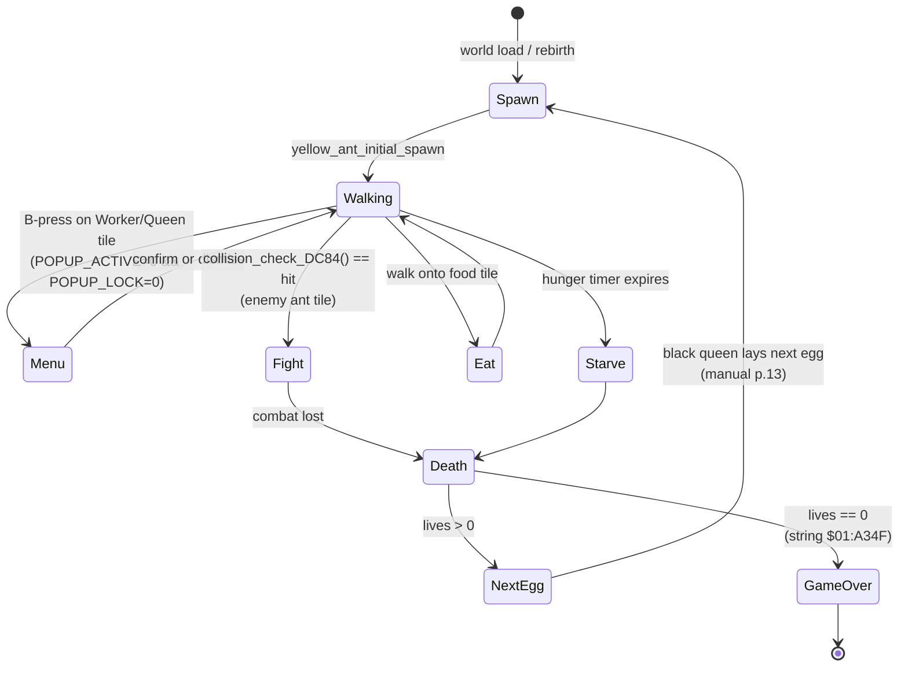

# The Yellow Ant — Player Avatar Composite

> Manual references: pp.10-13 ("The Yellow Ant — your avatar"),
> p.13 ("Death and Rebirth").

The Yellow Ant is the player's tangible presence in the colony. The
manual treats it as a single character; **in the code it is a
composite** of three independent subsystems that the engine glues
together at runtime. Nothing in the original manual or TCRF documents
this layering — it was reconstructed from `$03:9A86` (the per-tick
handler) and the cursor/body dispatchers in bank `$04`.

Cross-links: [Entity system](04-entity-system.md),
[Pathfinding](06-pathfinding.md).

---

## 1. The three pieces

| Piece          | Storage                | Handler                                    | Role |
|----------------|------------------------|--------------------------------------------|------|
| **Cursor T1**  | Entity slot, `type=1`  | `cursor_handler_type1_9D9D` ([entities_a.c:368](../entities_a.c)) | Reads `dp[$60/$61]` (JOY1 prev) for A/B presses. |
| **Cursor T2**  | Entity slot, `type=2`  | `cursor_handler_type2_9B9B` ([entities_a.c:452](../entities_a.c)) | Sign-magnitude delta accumulator for cursor X/Y. |
| **Body**       | Entity slot, `type=14` (Worker) or `type=18` (Queen) | `type14_dispatch_A112` ([entities_b.c:762](../entities_b.c)) or `queen_handler_A533` ([entities_c.c:550](../entities_c.c)) | The on-screen ant sprite — Worker when the player is a worker, Queen when transferred to the Queen body. |
| **Walker record** | `$7E:E8BE..E8C6` (20 bytes — distinct from entity table) | `$03:9A86` (per-tick) | Tracks player-specific simulation state. |
| **Popup gate** | `dp[$02A7]` / `dp[$02E1]` | `$04:AD01` (type `$1D`) | Locks out the Recruit/Queen menu while a popup is up. |

The walker record is the canonical "this is the player" container. It
lives outside the 118-slot entity table at `$7E:0600`. Layout (see
[`gaps.c`](../gaps.c) line 140 for the lift):

```c
/* gaps.c:202 */
#define YELLOW_ACTIVE   0xE8BE   /* word, 0 = unspawned                  */
#define YELLOW_TILE_X   0xE8C0   /* word, 0..127 (tile coord, not pixel) */
#define YELLOW_TILE_Y   0xE8C2   /* word, 0..63                          */
#define YELLOW_LIVES    0xE8C4   /* word, rebirth budget — manual p.13   */
#define YELLOW_DIR      0xE8C6   /* word, 0=N 1=E 2=S 3=W                */
#define YELLOW_CARRY    0xE8C8   /* food carried slot                    */
#define MASTER_FLAGS    0xE788   /* bit 0 = avatar disabled              */
```

The walker also stamps a tile-id `$6C` into the world tile map at
`$7F:6000 + (Y*128 + X)` to draw itself in the yellow palette
(palette baked into the tile pattern, not a per-slot override —
[`gaps.c`](../gaps.c) line 187).

---

## 2. Popup gating

The Yellow Ant can summon **Recruit** and **Queen** menus by holding
B over a tile of the right caste. Two direct-page bytes guard the
menu state machine — the body handler refuses to open a popup when
either is set:

```
dp[$02A7]   POPUP_ACTIVE   nonzero while any popup is on screen
dp[$02E1]   POPUP_LOCK     set by other UI consumers (House Screen,
                            tutorial). Cleared by the popup state
                            machine when it dismisses itself.
```

The menu engine at `$04:AD01` (entity type `$1D`) is a 10-state
machine — the lift summary lives in [`ENTITIES.md`](../ENTITIES.md)
("Types 1-31" row for `$1D`). It dispatches Recruit (5 / 10 / All /
Release 1 / 2 / All) and Queen (Dig New Nest / Lay Eggs).

---

## 3. Lifecycle



States as implemented:

- **Spawn** — `$03:9D3F` seeds a random column (0..127), row 63 (the
  center row), random cardinal facing, lives = 4. Stamps tile `$6C`
  at the chosen position. See [`gaps.c`](../gaps.c) line 236.
- **Walking** — `$03:9A86` ticks one tile in the current direction
  each "valid" frame (gated by `$E788 & 1`). Per-tick scent/hazard
  scan via `$03:94D1`. Movement direction is chosen by the same
  scent-gradient logic that drives every other ant — see
  [pathfinding](06-pathfinding.md). After a move, `$03:9E26` tests
  the destination tile; if a collision handler fires, the walker
  dies and the SFX `$48` plays.
- **Menu** — body sets `POPUP_ACTIVE`, hands control to the popup
  machine `$04:AD01`. Walking is suspended while the popup is up.
- **Fight** — body enters the combatant pool at `$7F:E87E`. See
  [`combat.c`](../combat.c) line 227. Combat resolution is
  probabilistic; the player does **not** get HP, just the
  post-engagement decay timer (Worker = 25 ticks, **Soldier** = 50 —
  see `combat.c:540` Worker `$19=25` and `combat.c:619` Soldier `$32=50`;
  earlier wiki drafts attributed the 50-tick value to the Queen body,
  which was wrong — the 50-tick decay is for the Soldier caste).
- **Eat / Starve** — feeding is per-tile (worker picks up food; queen
  body refills colony cache). Starvation is the master energy clock
  in `simulation.c`.
- **Death / Rebirth** — the higher-level dispatcher at `$02:ACF9`
  decrements `$E8C4` (lives), respawns via `$03:9D3F`. **The next
  egg laid by the Black Queen becomes the new Yellow Ant** (manual
  p.13). The actual mechanism: when `$E8BE == 0` and lives > 0, the
  next freshly-spawned Worker (type `$0E`) in the Black colony is
  reassigned as the avatar's body. When lives == 0 the tutorial string
  at `$01:A34F` ("lost its last...") fires and the game ends.

---

## 4. Tutorial divergence

When `dp[$97] == 1` the per-tick handler diverts to a separate
**tutorial Yellow Ant** body at `$03:9CBB` ([`gaps.c`](../gaps.c)
line 157). That body runs a scripted, deterministic walk for the
tutorial scenes instead of free pathfinding. The tutorial scripts live
in [`scenarios.c`](../scenarios.c).

---

## 5. Why this matters for the port

For the Flipper-Zero port at [`V4_6_FLIPPER_PORT.md`](../V4_6_FLIPPER_PORT.md),
the Yellow Ant is the only entity that **needs** a stable on-screen
position across power cycles (SRAM-backed). The walker layout above
maps directly onto the Flipper port's `player_t` struct — the rest
of the entity table can be re-populated from the colony arrays on
load.

See also: [`player_actions.c`](../player_actions.c) for the
`simulate_yellow_ant_dies` / `yellow_ant_*` action implementations,
and [`gaps.c`](../gaps.c) for the walker helpers
(`yellow_ant_is_alive`, `yellow_ant_initial_spawn`, `yellow_ant_despawn`).
