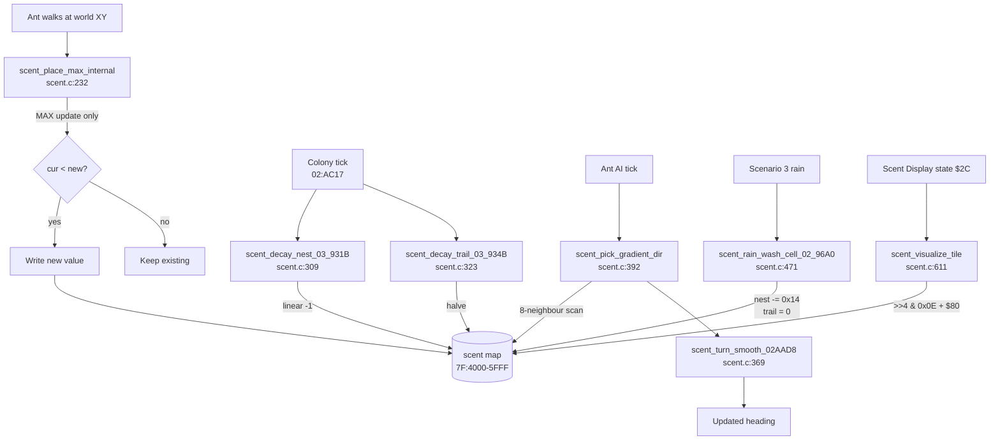

# 07 — Scent System (Pheromone Maps)

> **Manual references:** p.11 ("ants drop a chemical when carrying food"),
> p.26 ("Scents" overlay menu) of *SimAnt — The Electronic Ant Colony*.
> **Code:** [`scent.c`](../scent.c) (665 lines, lifted from banks `$02`/`$03`).

The "scent" system is the shared chemical communication channel for the
colony. It answers four mechanical questions:

| Question  | Where in code                                          |
|-----------|--------------------------------------------------------|
| **PLACE** — drop scent under an ant                    | `scent.c:232` (`scent_place_max_internal`) |
| **DECAY** — fade scent over time                        | `scent.c:309` (`scent_decay_nest_black_03_931B` and siblings) |
| **FOLLOW** — gradient-pick a heading                    | `scent.c:392` (`scent_pick_gradient_dir`) + `scent.c:429` (`scent_follow_gradient_02A710`) |
| **WASH** — Scenario 3 rain                              | `scent.c:471` (`scent_rain_wash_cell_02_96A0`) |

It also feeds the on-screen **Scent Display** overlay (manual p.26), which
the player toggles between *Hide / Black Nest / Red Nest / Black Trail /
Red Trail*.

---

## 1. Storage layout — four 2 KB maps at `$7F:4000-$7F:5FFF`

The four pheromone maps live contiguously in WRAM bank `$7F`:

| Range                    | Map                  | Decay model       | Behavior                              |
|--------------------------|----------------------|-------------------|---------------------------------------|
| `$7F:4000-47FF`          | **Black Nest**       | linear `-1/tick`  | Slow-decay colony "territory" aura    |
| `$7F:4800-4FFF`          | **Red Nest**         | linear `-1/tick`  | Same, opposite colony                 |
| `$7F:5000-57FF`          | **Black Trail**      | exponential `>>1` | Fast-fading food breadcrumbs          |
| `$7F:5800-5FFF`          | **Red Trail**        | exponential `>>1` | Same, opposite colony                 |

See the `#define` block at [`scent.c:156-159`](../scent.c#L156).

### Cell grid

* Each map is **64 × 32 cells** (X × Y) of **1 byte each** = 2048 bytes.
* The playfield is **2048 × 1024 world pixels** (entity coords use 11-bit X
  and 10-bit Y — see `entities_b.c:sub_D747_physics_step`).
* Therefore **1 scent cell = 32 × 32 world pixels**.
* Constants at [`scent.c:150-153`](../scent.c#L150):
  ```c
  #define SCENT_MAP_W           64
  #define SCENT_MAP_H           32
  #define SCENT_MAP_BYTES       2048
  #define SCENT_PIXELS_PER_CELL 32
  ```

### Index helper at `$02:F5A8`

ROM helper at `$02:F5A8` computes the byte offset from pre-shifted
coordinates. The C lift is at [`scent.c:201`](../scent.c#L201):

```c
static uint16_t scent_index_F5A8(uint16_t x_half, uint16_t y_half) {
    /* (Y >> 1) << 6 + (X >> 1) — caller has already LSR'd X and Y. */
    return (uint16_t)((((y_half) & 0xFF) << 6) | ((x_half) & 0x3F));
}
```

Every PLACE / CONSUME / FOLLOW call routes through this helper. The
implicit formula:

```
idx = (Y_pixel / 2) * 64 + (X_pixel / 2)
```

assuming the caller has already converted world coords to half-resolution
cell coords (one `LSR` each).

### Display ROM pointer table at `$00:E8FB`

The Scent Display overlay (state `$2C` / `$2D` — see
`states_gameplay.c::state_2C_2D_scent_overlay`) reads
`dp[$02B4]` as a 0..4 selector into a 5-entry pointer table at `$00:E8FB`:

| `dp[$02B4]` | Map base shown      |
|-------------|---------------------|
| 0           | `$7F:0000` (terrain — "Hide") |
| 1           | `$7F:4000` Black Nest |
| 2           | `$7F:4800` Red Nest   |
| 3           | `$7F:5000` Black Trail |
| 4           | `$7F:5800` Red Trail  |

The visualization mapper at [`scent.c:611`](../scent.c#L611):

```c
uint8_t scent_visualize_tile(uint8_t cell_value) {
    uint8_t tile = (uint8_t)((cell_value >> 4) & 0x0E);
    return (tile == 0) ? 0 : (uint8_t)(tile + 0x80);
}
```

This gives **8 intensity tiles** (`$80, $82, ..., $8E`). Zero scent leaves
the underlying terrain tile visible.

---

## 2. PLACE — MAX-update semantics

The ROM has four near-identical wrappers, one per map:

| ROM addr      | Map           | C function                                      |
|---------------|---------------|-------------------------------------------------|
| `$03:9389`    | Black Nest    | `scent_place_black_nest_03_9389` ([`scent.c:246`](../scent.c#L246))  |
| `$03:93AD`    | Red Nest      | `scent_place_red_nest_03_93AD` ([`scent.c:249`](../scent.c#L249))    |
| `$03:93D1`    | Black Trail   | `scent_place_black_trail_03_93D1` ([`scent.c:252`](../scent.c#L252)) |
| `$03:93F5`    | Red Trail     | `scent_place_red_trail_03_93F5` ([`scent.c:255`](../scent.c#L255))   |

All four delegate to the shared helper at [`scent.c:232`](../scent.c#L232):

```c
static void scent_place_max_internal(uint16_t map_base,
                                     uint8_t value,
                                     uint16_t x, uint16_t y) {
    uint16_t idx = scent_index_F5A8(x >> 1, y >> 1);
    uint8_t  existing = WRAM_7F(map_base + idx);
    if (value > existing)            /* MAX update: only overwrite stronger */
        WRAM_7F(map_base + idx) = value;
}
```

**Key insight:** placement is a **max-merge**, never additive. An ant
walking through a cell that already holds a stronger scent cannot weaken
it — only the **strongest depositor wins**. This makes the maps *peak
detectors* rather than concentration trackers.

> **Manual cross-ref (p.11):** *"Ants drop a chemical when carrying food
> back to the nest, creating a trail other ants can follow."* The food-
> carrying ant deposits `$FF` (full strength); ordinary foragers drop only
> their per-frame color byte. So the food-carrier's trail dominates.

### CONSUME — walking against a trail weakens it

ROM at `$03:9419` ([`scent.c:282`](../scent.c#L282)):

```c
void scent_consume_trail_03_9419(uint8_t arg, uint16_t x, uint16_t y) {
    uint16_t idx = scent_index_F5A8(x >> 1, y >> 1);
    uint16_t base = (arg != 0) ? SCENT_RED_TRAIL : SCENT_BLACK_TRAIL;
    uint8_t  cur = WRAM_7F(base + idx);
    if (cur == 0)        return;
    if (cur & 0x80)      return;        /* locked / max-strength trail */
    WRAM_7F(base + idx) = (uint8_t)(cur - 1);
}
```

**Bit 7 = "locked" / max-strength.** Trail cells with `>= $80` are
*protected from weakening*. This is the food-carrying ant's master trail —
foragers walking back along it cannot erode it. Only **decay** and **rain
wash** can clear a locked trail.

---

## 3. DECAY — linear nest, halving trail

Per colony tick (called from `$02:AC17 / AC1B / AC38 / AC3C` — the
colony-tick router dispatched by colony color):

| ROM addr      | Map           | Decay law                                |
|---------------|---------------|------------------------------------------|
| `$03:931B`    | Black Nest    | `if (m[i]) m[i]--;` (linear `-1`)        |
| `$03:9333`    | Red Nest      | same                                      |
| `$03:934B`    | Black Trail   | `m[i] = (m[i] < 8) ? 0 : (m[i] >> 1);`   |
| `$03:936A`    | Red Trail     | same                                      |

Implementations at [`scent.c:309-335`](../scent.c#L309).

**Decay times from full strength ($FF):**

* **Nest:** 256 ticks to fade to 0 (slow territory marker)
* **Trail:** ~5 halvings to fade to 0 (`$FF → $7F → $3F → $1F → $0F → $07 → 0`)

This is what makes nest scent feel "permanent" (defines colony territory)
while trail scent feels "fresh" (only useful while ants are actively
foraging).

---

## 4. FOLLOW — 8-neighbour scan with turn smoothing

ROM at `$02:A710`. The C lift at [`scent.c:429`](../scent.c#L429) wraps
the gradient-pick helper at [`scent.c:392`](../scent.c#L392).

### Algorithm

1. Read the **center cell** scent (color-selected by ant's color flag).
   If center is 0 → no scent here → fall back to wandering / target-follow.
2. Scan **8 compass neighbours** (N, NE, E, SE, S, SW, W, NW); track the
   max value found and the direction that produced it.
3. Pass `(current_dir, gradient_dir)` to the **turn-smoothing lookup
   table** at `$02:AAD8`.
4. Return the smoothed next heading (0..7).

The 8-direction offset arrays are at [`scent.c:359-360`](../scent.c#L359):

```c
static const int8_t scent_dir_dx_028065[8] = {  0,  1,  1,  1,  0, -1, -1, -1 };
static const int8_t scent_dir_dy_028077[8] = { -1, -1,  0,  1,  1,  1,  0, -1 };
```

(compass clockwise from north: N, NE, E, SE, S, SW, W, NW). ROM bases at
`$02:8065` and `$02:8077` — the same tables the combat resolver and
ant-lion AI use (see [`08-combat.md`](08-combat.md#neighbour-offset-tables)).

### Turn-smoothing lookup — `$02:AAD8`

A **64-byte table** indexed as `next_dir = table[current * 8 + gradient]`
that softens 180° flips. From [`scent.c:369`](../scent.c#L369):

```
current=N (0):    {N, NE, NE, NE, NW, NW, NW, NW}    /* gradient S → drift NW, not U-turn */
current=NE(1):    {N, NE, E,  E,  E,  E,  N,  N}
current=E (2):    {NE,NE, E,  SE, SE, SE, SE, NE}
...
```

An ant heading **N** that sees the strongest scent due **S** does *not*
snap around. It takes the table-defined intermediate (typically a
tangential turn). This is what gives SimAnt ants their characteristic
naturalistic walk — they curve onto trails rather than ricocheting.

---

## 5. RAIN WASH — Scenario 3 "Rainy Yard"

ROM at `$02:96A0` ([`scent.c:471`](../scent.c#L471)):

```c
void scent_rain_wash_cell_02_96A0(uint16_t cell_offset) {
    uint8_t v;
    v = WRAM_7F(SCENT_BLACK_NEST + cell_offset);
    WRAM_7F(SCENT_BLACK_NEST + cell_offset) = (v < 0x14) ? 0 : (v - 0x14);
    WRAM_7F(SCENT_BLACK_TRAIL + cell_offset) = 0;
    v = WRAM_7F(SCENT_RED_NEST + cell_offset);
    WRAM_7F(SCENT_RED_NEST + cell_offset) = (v < 0x14) ? 0 : (v - 0x14);
    WRAM_7F(SCENT_RED_TRAIL + cell_offset) = 0;
}
```

**Per cell, per rain-frame:**

* Nest scents lose **`$14` (20)** each pass, clamped at 0.
* Trail scents are **fully erased**.

This matches the manual's flavor text: rain washes away the chemical
breadcrumbs but the colony's *territory* aura only weakens (the ants are
still inside, still smelling like home).

---

## 6. SEED — initial nest aura

ROM at `$03:9269` (Black) / `$03:92C2` (Red). Lift at
[`scent.c:530`](../scent.c#L530).

A 64-entry **column table** (`$7F:E946` for Black, `$7F:E9C6` for Red) holds
the per-row X coordinate of each nest's main shaft. The seed routine
walks Y = 0..63:

* `col_x = column_table[Y]` (skip if 0 — no nest in that row)
* Read the **nest tile** at `(col_x, Y)` from `$7F:6000` / `$7F:8000`
* If tile == `$51` (tunnel interior) → seed = `0` (no scent inside tunnel)
* Else → seed = `$FF` (max scent — nest wall/chamber)
* Write to the *half-resolution* scent cell at `(col_x/2, Y/2)`

Result: every nest **wall/chamber cell gets `$FF`**, every interior tunnel
cell gets `0`. Foragers follow the gradient back to the wall.

---

## 7. RESET

ROM at `$03:85DA` ([`scent.c:576`](../scent.c#L576)): four `memset(0, 2048)`
calls. Hit on every new scenario / new game.

---

## 8. Flow — place → decay → follow



---

## 9. Surprising findings

1. **The "MAX-update" rule is unique to SimAnt's pheromone model.** Most
   ant-sim papers use additive/clipped concentration; SimAnt is a peak
   detector. This makes the food-carrying ant's deposit (which is always
   max strength) immediately dominant, even on a heavily-walked path.

2. **Bit 7 is a "trail lock" flag.** Values `>= $80` are protected from
   the per-ant weakening pass. This is undocumented in the manual but
   it's the mechanism that keeps a fresh food-trail visible even while
   100 ants march back along it.

3. **The nest column table doubles as nest geometry.** The same per-row X
   table that seeds scent is the canonical "where does this colony live"
   description used by the nest renderer (`states_gameplay.c`). Changing
   the scent seed implicitly relocates the nest.

4. **Scent cells are half the resolution of the nest tile grid** — one
   scent cell covers a 2x2 block of nest tiles. The seed routine uses
   this on purpose (so tunnel interior at full nest-grid resolution can
   selectively *not* leak scent into the surrounding chamber).

5. **The turn-smoothing table is the secret sauce of "natural-looking"
   ant motion.** Without it ants would do hard 90° turns toward the
   gradient max every tick (jittery). With it they curve onto trails.
   The full 64 bytes were reconstructed from `$02:AAD8` sequential reads
   — see `scent.c:369`.
