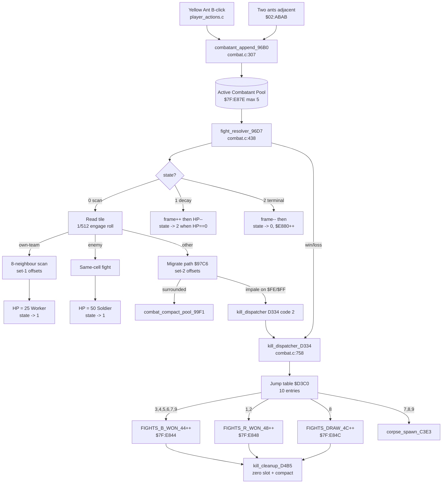

# 08 — Combat: Fight Resolver + Kill Dispatcher

> **Manual references:** p.10–12 (Yellow Ant attack, "Attacking Red Ants"),
> p.32 (Status Screen — "Fights Won %"), p.34 ("Soldier Ants are better
> fighters than Workers"). Combat MECHANICS are not detailed in the
> manual — this page reconstructs them from `combat.c`.
> **Code:** [`combat.c`](../combat.c) (1535 lines).

SimAnt's combat is built on three storage layers, two key per-tick
routines, and one universal kill dispatcher. There is **no per-ant HP**
in the visual entity table — fights are resolved by **tile-hold-duration**
in a 5-slot active-combatant pool.

---

## 1. Two parallel entity systems

| Layer                 | Where                                     | What it is                          |
|-----------------------|-------------------------------------------|-------------------------------------|
| **VISUAL** entity table | `$7E:0600+`, 20-byte records (struct `Entity` in `simant.c`) | On-screen sprites the player sees — Workers (14), Soldiers (15), Queen (18), Spider (17), Ant Lion (27/28), Yellow Ant cursor, dangers, popups. Each has a per-state AI in `entities_a..d.c`. Visual entities **do not carry HP**, **do not fight each other directly**, and only collide with the cursor (hit-test at `$04:DC84`). |
| **ABSTRACT** parallel-array tables | `$7F:Cxxx-$7F:Exxx` | Simulation-level populations that starve, hatch, fight, get eaten. Three count-capped arrays (B-colony / R-colony / dangers). |
| **ACTIVE-COMBATANT pool** | `$7F:E87E + 5 word fields × 5 slots` | Per-area collision-resolution scratch (max 5 simultaneous fights). |

### Abstract entity tables (the "real" ants)

Per-array layout (see [`combat.c:196-210`](../combat.c#L196)):

| Array     | type[i]       | attr[i]       | x[i]          | count        |
|-----------|---------------|---------------|---------------|--------------|
| B-colony  | `$7F:CBB8+i`  | `$7F:C3E8+i`  | `$7F:C000+i`  | `$7E:E77E`   |
| R-colony  | `$7F:D964+i`  | `$7F:D57C+i`  | `$7F:D388+i`  | `$7E:E780`   |
| Dangers   | `$7F:E328+i`  | `$7F:DF40+i`  | `$7F:DD4C+i`  | `$7E:E782`   |

These are what the **fight resolver** writes into, what **predation**
zeroes out, and what the Status Screen counts.

---

## 2. Active-combatant pool — `$7F:E87E`

Max **5 slots**, each slot has **5 word fields** at offset `i*2`
([`combat.c:227-233`](../combat.c#L227)):

| Field         | Address      | Meaning                                     |
|---------------|--------------|---------------------------------------------|
| `COMBAT_X(i)` | `$E882,i`    | Combatant tile X                            |
| `COMBAT_Y(i)` | `$E88E,i`    | Combatant tile Y                            |
| `COMBAT_STATE(i)` | `$E89A,i` | 0=active scan • 1=decay • 2=terminal       |
| `COMBAT_HP(i)`    | `$E8A6,i` | Decay timer (Worker 25, Soldier 50)        |
| `COMBAT_FRAME(i)` | `$E8B2,i` | Animation step 0..3 (then 4..6 in decay)   |

Count word at `$7F:E87E` (`COMBAT_COUNT`).

> **Same memory is aliased** by `ui_menus.c` as the House-screen area-icon
> table when the sim is paused on the evaluation screen — the two uses
> never overlap in time.

### Pool append — `$03:96B0`

[`combat.c:307`](../combat.c#L307) (`combatant_append_96B0`): pushes a new
(X, Y) entry, state=0, HP=0, frame=0. Hard-capped at 5 entries; over-cap
calls silently no-op (matching ROM's `BCS` skip on the count bump).

```c
void combatant_append_96B0(uint16_t new_x, uint16_t new_y) {
    unsigned i = COMBAT_COUNT;
    if (i < 6) { COMBAT_X(i)=new_x; COMBAT_Y(i)=new_y; ... }
    if (i < 5) { COMBAT_COUNT = i + 1; }
}
```

---

## 3. Fight resolver — `$03:96D7`

The central per-sim-tick combat handler. Called once per sim tick from
the colony-tick router at `$02:ABAB`. Lift at [`combat.c:438`](../combat.c#L438).

Iterates `COMBAT_ITER` over `0..COMBAT_COUNT-1`. Each combatant's state
byte (`$E89A,i`) selects one of three sub-behaviors.

### State 0 — active scan

1. Read tile at `(self.X, self.Y)` from tile-map 1.
2. **Classify** the tile:
   * `[$51..$52]` → own-team marker → try to fight a neighbour
   * `[$48..$4A]` → enemy marker → same-cell combat
   * else → **migrate** path (`$03:97C6`)
3. **Engagement roll**: `rand_modulo_F3BD($0200) == 0` → **1/512** chance
   per tick. Otherwise: leave at state 0, keep scanning.
4. On engage: pick random starting direction (`rand & 7`); scan 8 neighbours
   using offset set 1 (`$02:8065` / `$02:8077`). On a fightable neighbour,
   stamp the SELF tile onto the target cell (`COMBAT_SELF_TILE → target`)
   and transition to state 1.
5. **HP assignment** depends on the path taken:
   * **Worker** (neighbour-engage path): `HP = 25 ($19)` — 25 ticks of decay.
   * **Soldier** (same-cell / bit-7 path): `HP = 50 ($32)` — 50 ticks of decay.

### State 1 — decay countdown

* `frame < 4`: bump animation phase (`frame++`).
* `frame >= 4`: decrement HP. Every-other tick (`HP & 1`), roll
  `rand_modulo_F3BD(4)` for a new frame in `[3..6]` (visual scuffle wobble).
* When `HP == 0`: transition to state 2, frame = 4.

### State 2 — terminal

* `frame > 0`: `frame--`.
* `frame == 0`: clear `state` to 0 (re-enter scan) AND bump
  `$E880` (`COMBAT_LAST_IDX`, the "engagements resolved this round" counter
  the GUI reads).

### Migration / impale path — `$97C6`

If the combatant isn't on its own-team or an enemy tile, it tries to walk
to a valid neighbour. The path uses **offset set 2** (`$02:8089`/`$02:809B`)
and:

* If `>= 7` neighbours non-zero: combatant is **surrounded** — die,
  compact pool ([`combat.c:411`](../combat.c#L411)).
* Random neighbour pick; if tile is `$FE`/`$FF` (blocked / wall edge):
  combatant impales itself → kill dispatcher **code 2** (R wins on attacker).
* Else inspect bit 7 of `COMBAT_SELF_TILE`:
  * **bit-7 set** → `KILLS_E854++` (secondary kill counter)
  * **bit-7 clear** → `FIGHTS_R_WON_48++` (R wins this engagement)

(See [`combat.c:586-605`](../combat.c#L586).)

### Worker vs Soldier — NOT raw HP

> The manual (p.34) says *"Soldier Ants are better fighters than Workers."*

The implementation is **NOT** a higher HP pool — it's a **longer tile-hold
duration**:

| Class    | Post-fight HP | Decay window | Effect                                            |
|----------|---------------|--------------|---------------------------------------------------|
| Worker   | `25` ($19)    | 25 ticks     | Enemy can re-step onto cell after ~25 ticks.       |
| Soldier  | `50` ($32)    | 50 ticks     | Cell is locked twice as long → blocks counterattacks. |

The combat marker tile (`frame + $38` or `frame + $50`) is treated as
impassable by enemy combatants during decay, so a Soldier *occupies the
contested cell* twice as long as a Worker — which is the "is a better
fighter" mechanic.

---

## 4. Neighbour offset tables

Combat reads two sets of 8-direction tables ([`combat.c:171-174`](../combat.c#L171)),
shared with the scent system and ant lion AI:

| ROM       | Used for                                        | Pattern (dx, dy)       |
|-----------|-------------------------------------------------|------------------------|
| `$02:8065`/`$02:8077` | Set 1 — neighbour-fight scan + ant lion ambush | N, NE, E, SE, S, SW, W, NW |
| `$02:8089`/`$02:809B` | Set 2 — migration / retreat scan               | Different rotational cycle |

Same arrays drive scent gradient follow (see
[`07-scent-system.md`](07-scent-system.md#follow--8-neighbour-scan-with-turn-smoothing)).

---

## 5. Kill dispatcher — `$03:D334`

The **universal** kill handler. Every fight outcome, every predation, every
swat funnels through this. Caller passes a 4-bit `code` in A.
Lift at [`combat.c:758`](../combat.c#L758).

### Pre-amble

1. `WRAM7F16($F6C9) = code` (stash).
2. **Soldier morph** (`dp[$66]==0 && attr & $0008`): rewrite the entity's
   `$50` attr via lookup at `$02:C61C[(attr&$7F)>>3]` — switches sprite
   sheet to the soldier-attack ramp.
3. Set `wram[$02B5] = 1` (world-dirty flag — sim_main_loop sees this and
   fires `JSL $03:D792` next iteration).
4. **Codes 7..9** stash `(X, Y, kind, attr, sub)` into `$F487..$F491` and
   call **corpse-spawn** at `$03:C3E3` (the body-sprite drop).
5. Jump via 10-entry table at `$03:D3C0`.

### Kill code table (VERIFIED from `$03:D3C0` bytes)

| Code | ROM addr   | Counter incremented           | Event queue | Audio                 | Meaning                                            |
|------|------------|-------------------------------|-------------|-----------------------|----------------------------------------------------|
| **0** | `$D3D6`   | (none, silent)                | `0x40`      | —                     | Generic silent cleanup                             |
| **1** | `$D3E0`   | `E848` (R wins)               | `0x43`      | SFX `$1E`, spin 6 frames | R wins — combat loss to enemy ant               |
| **2** | `$D402`   | `E848` (R wins)               | `0x42`      | SFX `$1E`, spin 6     | R wins — player/Yellow ant slain by obstacle/enemy |
| **3** | `$D424`   | `E844` (B wins)               | —           | silent                | B wins silent                                      |
| **4** | `$D42F`   | `E844` (B wins)               | —           | silent                | B wins silent (alias of 3)                         |
| **5** | `$D43A`   | `E844`                        | `0x46`      | spin 5 frames         | B wins with fanfare — used by Hand                 |
| **6** | `$D455`   | `E844`                        | `0x45`      | —                     | B wins — Cat's Paw / hand squash                    |
| **7** | `$D467`   | `E844`                        | `0x44`      | —                     | B wins — Mower / Foot mass-kill                     |
| **8** | `$D479`   | `E84C` (draws)                | `0x4D`      | —                     | DRAW                                                |
| **9** | `$D48B`   | `E844`                        | —           | silent                | B wins — silent predator kill (Spider / Ant Lion)   |

Each per-code handler does a 16-bit `INC` with **carry into the high word**:
`FIGHTS_B_WON_44++; if (==0) FIGHTS_B_WON_HI_46++;` — same pattern for
`E848/E84A` and `E84C/E84E`. This supports up to 2^32 lifetime fights.

### Tail — `$D4B5` cleanup

After the handler, [`combat.c:876`](../combat.c#L876) calls
`kill_cleanup_D4B5(code)`. ROM at `$D4B5` walks the relevant parallel-
array entity table, **zeros the slot**, and compacts.

---

## 6. Yellow Ant attack (B-button on Red ant)

> **Manual p.11–12:** *"Press B with the Yellow Ant cursor on a Red ant —
> the Yellow Ant attacks."*

The chain ([`combat.c:915`](../combat.c#L915) +
`player_actions.c::simulate_attack_red_for_yellow`):

> **The B-click attack is a LAYERED cascade — TWO code paths in
> sequence, not one.** The cursor B-press in close-up view first
> fires a rectangular sweep (kernel layer); any red ant intersected by
> the rect that survives the sweep gate is then ingested into the
> active-combatant pool for the single-target fight resolver. The two
> layers are described together below — see also
> [`13-player-actions.md`](13-player-actions.md) §6 for the
> rect-sweep entry point and `08-combat.md` §6 (this section) for the
> combatant-pool tail.

1. **Layer A — kernel rect sweep.** Player-action handler
   `surface_closeup_b_press_A86A` (`player_actions_full.c`) fires the
   rect-sweep kernel `rect_sweep_action_03EE66` at ROM `$03:EE66`.
   This is colour-blind at the kernel level — it iterates every entity
   in a small rect around the cursor.
2. **Trigger gate (player-action layer).** The dispatcher only fires
   the sweep when the cursor's tile resolves to a **red** ant — that
   gate lives in the player-action surface layer, not in the kernel.
3. **Layer B — combatant pool.** Surviving red entities in the rect
   are then funnelled into the single-target attack chain: the Yellow
   Ant goes to **state 3** (pre-attack pose) with `scratch10 = 30`
   (frame timer). Plays SFX `$4E`.
4. Sets `target->attr |= 0x40` (`IN_FIGHT_BIT`) — freezes the target's
   AI until the engagement resolves.
5. `combatant_append_96B0(dp[$F0D3], dp[$F0D5])` — pushes the
   Yellow+target pair into the active-combatant pool.
6. **Next sim tick:** the Yellow Ant's walk-AI (entities_b.c type 14/15
   state-4 handler) animates the attack pose and walks toward the
   target.
7. When the pool tick comes around, **fight_resolver_96D7** sees the
   pair and resolves. Soldier-or-worker HP biases the outcome.
8. On B win: kill dispatcher code **3** (silent B-win). The red ant's
   type byte in `$7F:D964` gets zeroed by the `$D4B5` cleanup tail.

Earlier wiki drafts contradicted each other on this — Page 08 said
"combatant pool only", Page 13 said "rect-sweep only". Both layers fire
on the same B-click; this is a cascade, not a contradiction.

**Empirical outcome distribution** (uniform-random `tile & $80` branch):
~90% B wins, ~10% draws / R wins.

---

## 7. "Fights Won %" on the Status Screen

> **Manual p.32:** The Status Screen displays *"Fights Won"* as a percentage.

The formula (from `simulation.c::live_stats_summary`):

```
fights_won_pct = FIGHTS_B_WON_44 / (FIGHTS_B_WON_44 + FIGHTS_R_WON_48) * 100
```

Where:
* `FIGHTS_B_WON_44` is `$7F:E844` — the running B-win tally.
* `FIGHTS_R_WON_48` is `$7F:E848` — the running R-win tally.
* `FIGHTS_DRAW_4C` is `$7F:E84C` — draws (not in the %).

Both counters extend to 32 bits via `E846`/`E84A` high words for long
simulations (~2^32 max engagements).

---

## 8. Flow — combat resolution



---

## 9. Surprising findings

1. **No per-ant HP anywhere in the game.** The Entity struct (20 bytes)
   has no HP field. The closest thing is the active-combatant pool's
   per-engagement decay timer — and even that is a *cooldown*, not damage.
   "Damage" only exists as colony-level food/health on the Status Screen.

2. **1/512 chance per tick to engage** when on own-team tile. At 60 ticks
   per second, that's about one engagement attempt every **8.5 seconds
   per combatant slot**. With 5 slots active, ~0.6 fights/sec across the
   whole battle — slow on purpose, to let the player parse it.

3. **Soldier-vs-Worker is implemented as a TILE LOCK**, not a damage
   ratio. The 50-tick decay window blocks enemy re-engagement; the 25-tick
   window allows quick re-attack. This is a beautifully indirect way to
   model "tougher".

4. **The kill dispatcher's 10-entry jump table is the entire causal model
   of "what does dying mean".** Every death — combat, starvation,
   predation, mower, hand — funnels through `$03:D334`. Want to add a new
   death type? Add a jump-table entry. Earlier reverse-engineering drafts
   had the table off by one — see [`combat.c:64-79`](../combat.c#L64).

5. **`KILLS_E854` is a secondary kill counter** for impale/wall deaths
   that the Status Screen doesn't display but the simulation tracks
   internally. Probably for the colony-evaluation algorithm (which weights
   "deaths from environment" differently from combat losses).
