# 09 — Predation: Spider, Ant Lion, Mower, Hand, Foot

> **Manual references:** p.34 (cast of characters — Spider, Ant Lions,
> Caterpillars), p.36 (Dangers — Lawn Mower, Cat's Paw, Human Feet, Hand).
> Predation MECHANICS are not detailed in the manual — this page
> reconstructs them from `combat.c` + `entities_c.c` + `entities_d.c`.
> **Code:** [`combat.c`](../combat.c) (predation lifts at lines 1051, 1177,
> 1252, 1307, 1363).

SimAnt has **six distinct predator types**, each with its own kill rule:

| Predator        | Trigger                  | Kill model                            | ROM addr      | Kill code |
|-----------------|--------------------------|---------------------------------------|---------------|-----------|
| Spider (type $11 / decimal 17)| every 16 sim-ticks       | 1/128 RNG on 2-step diagonal cell      | `$03:C0FD`    | corpse-spawn `$B198` (no D334) |
| Ant Lion (type $1C / decimal 28)   | every 4 sim-ticks (4× faster) | same as spider, faster cadence    | `$03:C0FD`    | same                            |
| Lawn Mower      | cursor delta             | 25% per B-ant + 50% fanfare-announce  | `$03:EF1E`    | 7 (mass-kill fanfare)           |
| Cat's Paw       | cursor delta             | same as mower (shared routine)        | `$03:EF1E`    | 6 (cat's-paw fanfare)           |
| Human Foot      | cursor delta             | same as mower (shared routine)        | `$03:EF1E`    | 6 / 7                            |
| Hand            | rect-bounds              | 100% within bounding rect             | `$03:EF02`    | 5 (fanfare)                     |

Plus two "soft kills" (food / starvation):

| Soft kill   | Trigger                         | ROM addr   | Counter            |
|-------------|---------------------------------|------------|--------------------|
| Eat (food)  | ant lands on food crumb tile    | `$03:8C00` | `$E764` EATEN++    |
| Starve      | hunger underflow                | `$03:8DBA` | `$E766` STARVED++  |

---

## 1. Spider — `$03:C0FD`

Visual handler: `entities_c.c::type17_handler_A43B` — note the suffix
`17` is **decimal**, so this is type **$11** (= decimal 17). The handler
lives at ROM `$04:A43B`. Predation logic: [`combat.c:1051`](../combat.c#L1051)
(`spider_predation_tick_C0FD_excerpt`).

### Per-spider tick counter — `$EE86`

Decremented every sim tick. Two cadences are gated off this counter:

* **Every 64 ticks** (`$EE86 & $3F == 0`): a "passive nibble" — picks a
  random candidate ant and calls `corpse_spawn_B198` directly. Resets the
  counter from `$EEB2`.
* **Every 16 sim-ticks** (`$E788 & $0F == 0`): the active hunt check.

### Hunt check

Gated on `dp[$50] == $60` (spider's predator tag) AND `dp[$4A] >= 2`
(ant in walking state).

```c
unsigned idx = (WMEM16(0x4C) ^ 0x0004) & 0x0007;   /* "look the other way" 50% */
int16_t dy = neigh_dy_set1_8077[idx];
int16_t dx = neigh_dx_set1_8065[idx];
uint16_t tx = WMEM16(0x46) + (uint16_t)(dx << 1);  /* 2-step diagonal scan */
uint16_t ty = WMEM16(0x48) + (uint16_t)(dy << 1);
if (ant_at_position_2991(tx, ty)) {
    /* 1/128 kill probability per check */
    if (rand_modulo_F3BD(0x0080) <= WMEM16(0xE940)) {
        /* SUCCESSFUL PREDATION */
        ...
    }
}
```

(Excerpt from [`combat.c:1097-1131`](../combat.c#L1097).)

### Net rate

The cadence gate `$E788 & $0F == 0` is keyed off **`SIM_COUNTER`**
(see `02-simulation-tick.md` — sim tick rides at ~8.58 Hz, NOT NMI at
60 Hz):

* 1 check every 16 **sim** ticks at 8.58 Hz = **~0.54 checks/sec/spider**
* 1/128 per successful check = **~1 kill / 237 seconds per spider per
  contested ant** (≈ 4 minutes), matching the manual's "ants are eaten
  over time" pace.

### Kill bookkeeping

On success, the ROM branches on `dp[$54]` to pick the side:

* `$54 == 0` → B-side: `b_kill_alloc_984B(1)` + `b_kill_book_D760()`
* `$54 != 0` → R-side: `r_kill_alloc_989C(1)` + `r_kill_book_ED7D()`

Then `corpse_spawn_B198()`. **Critically: this path does NOT call the
kill dispatcher `$03:D334`.** The kill bumps **`EATEN_COUNTER ($E764)`**
internally (via the `$03:8C00` eat chain that `corpse_spawn_B198` invokes),
NOT the `FIGHTS_*_WON` counters.

### Despawn

When `$E940` hits 0 (the spider's "ate enough" budget):

* If `dp[$50] == $0018 || $0038`: clear the predator bit (`$50 &= ~$08`)
  and call `predator_despawn_9D6D` — spider walks off.

---

## 2. Ant Lion — `$03:C0FD` (shared) / type 28 in `entities_d.c`

Same routine as the spider, but the cadence gate is different:

```
Spider:   if (E788 & $0F) == 0  -> every 16 ticks
Ant Lion: if (E788 & $03) == 0  -> every  4 ticks  (4x faster)
```

Visual handler: `entities_d.c::type28_dispatch_AC3A` — a 3-state ambush AI:

| State | Behavior                  | Timer | Lift                                |
|-------|---------------------------|-------|-------------------------------------|
| 0     | Spawn, init at row $0380 | $50   | `entities_d.c:type28_state0_init_AC4C` |
| 1     | Ambush — look around     | $50   | `entities_d.c:type28_state1_ambush_AC67` |
| 2     | Hunt — move toward target| $5A   | `entities_d.c:type28_state2_hunt_AC99` |

State 2 has a **1-in-10** chance per timer expiry to revert to state 1
(re-ambush). State 1 has a low timer (~80 frames), state 2 has a higher
one (~90 frames) — so the creature **spends most of its time waiting**.

> **Manual p.34:** *"Ant Lions wait in pits and pounce on passing ants."*
> The "1-in-10 revert" is the "pounce, miss, re-ambush" loop.

The actual kill is still the shared `$03:C0FD` body, just clocked 4x
faster — at 8.58/4 ≈ 2.14 checks/sec and 1/128 success, the Ant Lion
can kill ~1 ant per **~60 seconds** vs the Spider's ~237 seconds (~4
minutes).

---

## 3. Lawn Mower / Cat's Paw / Human Foot — `$03:EF1E`

These three share one mass-kill sweep. ROM at `$03:EF1E`; lift at
[`combat.c:1177`](../combat.c#L1177).

### Trigger — cursor delta

Called from `$03:EA8C` when the **mouse cursor moves**. Cursor delta is
read from `$7E:E86E` (dX) and `$7E:E870` (dY). Any non-zero delta fires
the sweep.

### Sweep algorithm

```c
void mass_kill_sweep_EF1E(void) {
    if (dp[0x99] == 0) return;            /* PLAY_MODE gate */
    unsigned i = B_COUNT;
    while (i > 0) {
        i--;
        if (B_TYPE(i) == 0) continue;     /* empty slot */
        if (rand_modulo_F3BD(4) != 0)     /* 25% kill chance (1-in-4) */
            continue;
        slotmap_select_a_F59F();
        wram[0x13000 + (attr_y * 0x80 + x)] = 0;  /* zero tile */
        B_TYPE(i) = 0;                     /* zero entity (kill) */
    }
    if (WMEM16(0x66) > 1) return;
    if (WMEM16(0x4A) != 1) return;
    if (rand_modulo_F3BD(2) == 0) return;  /* 50% fanfare */
    kill_dispatcher_D334(6);               /* cat's-paw fanfare */
}
```

### The 1/4 math

> **Manual p.36:** *"Lawn Mowers grind up and blow away 1/4 of all ants
> they contact."*

The implementation produces **exactly 1/4 on average**:

* **25% per-ant kill** (`rand_modulo_F3BD(4) == 0` — 1-in-4) applied
  to every B-colony slot. The earlier wiki figure of "20%" was wrong:
  the modulus-4 RNG returns 0..3 uniformly, so `== 0` is 25%.
* Iterates ALL B-colony entries — no bounding rect, no spatial gate.
* The 50% post-fanfare gate determines whether the kill is *announced*
  (via D334 code 6/7 fanfare), **NOT** whether it occurs. Kills happen
  regardless of fanfare.

This is **mass-kill at the granularity of entity slots, not pixel
collision** — every ant in the colony rolls a 1-in-4 die when the
cursor moves, irrespective of whether it's anywhere near the mower
sprite.

### Kill code distinctions

| Predator    | D334 code | Event queue | Note                          |
|-------------|-----------|-------------|-------------------------------|
| Lawn Mower  | **7**     | `$44`        | event 0x44 — mower-specific   |
| Cat's Paw   | **6**     | `$45`        | event 0x45 — generic squash   |
| Human Foot  | **6** / 7 | `$45` / `$44` | shares either path           |

The actual sweep is identical — only the post-fanfare code differs.

---

## 4. Hand — `$03:EF02`

Rectangular bounding-box test. ROM at `$03:EF02`; lift at
[`combat.c:1252`](../combat.c#L1252).

```c
void hand_squash_EF02(uint16_t rect_x1, uint16_t rect_x2,
                       uint16_t rect_y1, uint16_t rect_y2) {
    if (dp[0x46] < rect_x1) return;
    if (dp[0x46] >  rect_x2) return;
    if (dp[0x48] < rect_y1) return;
    if (dp[0x48] >  rect_y2) return;
    kill_dispatcher_D334(5);                /* kill code 5 — fanfare */
}
```

* **100% kill chance** within the rect — no RNG.
* Single-entity check; the caller (`$02:DD5F` danger-event tick) invokes
  this in a loop over all entities in the rectangle, so multiple ants per
  swing are possible.
* Kill code **5** → queue event `$45` + spin 5 frames + `INC E844`.

The hand is the **most precise** predator: small footprint, but everything
inside is dead.

---

## 5. Eat (food consumption) — `$03:8C00`

Not a predation kill — but it's the path that bumps `EATEN_COUNTER`.

When an ant **steps onto a food crumb tile**, ROM at `$03:8C00`
([`combat.c:1307`](../combat.c#L1307)):

1. Clear the food tile at the ant's position (`$02:89ED`).
2. Write a "drift" tile (`$60 + variant`) at +1 cell in the ant's heading.
3. Write an "eaten" marker tile (`$68 + variant`) at +2 cells.
4. **`INC $E764`** (`EATEN_COUNTER++`).

The ant **carries** the food to its mouth — the two-step drift is the
visual carrying animation.

> **Manual p.34:** *"Caterpillars are food."* When the ant's tile is on
> a caterpillar / food source, the EATEN counter ticks up. This is the
> same counter the Spider/Ant Lion bumps via `corpse_spawn_B198 → $03:8C00`.

So `EATEN_COUNTER` is **dual-purpose**: it counts "ants ate food" AND
"ants were eaten". The Status Screen reads it as "ants eaten by colony"
plus / minus context from `STARVED_COUNTER`.

---

## 6. Starve — `$03:8DBA`

ROM at `$03:8DBA`; lift at [`combat.c:1363`](../combat.c#L1363).

When an ant's hunger underflows:

1. Write tile **`$E8`** (corpse marker) at the ant's position via
   `tile_commit_855B`.
2. **`INC $E766`** (`STARVED_COUNTER++`).

The corpse tile `$E8` is then a food source for the next ant — the
**death recycles into the eat path**, closing the loop.

---

## 7. Predator kill radius — summary

| Predator    | Radius                         | Probability per check     | Spatial gate         |
|-------------|--------------------------------|---------------------------|----------------------|
| Spider      | 1 cell — 2-step diagonal       | 1/128                     | grid-adjacent only   |
| Ant Lion    | 1 cell — 2-step diagonal       | 1/128 (4× faster cadence) | grid-adjacent only   |
| Hand        | bounding rect (~2×2 tiles)     | 100%                       | within rect          |
| Cat's Paw   | none (whole screen)            | 25% per-ant kill (50% fanfare-announce is independent) | no spatial gate      |
| Foot        | none (whole screen)            | 25% per-ant kill (50% fanfare-announce is independent) | no spatial gate      |
| Mower       | none (whole screen)            | 25% per-ant kill (50% fanfare-announce is independent) | no spatial gate      |

---

## 8. Flow — predation triggers

```mermaid
flowchart TD
    subgraph PASSIVE[Per-sim-tick predators]
        S[Spider tick<br/>combat.c:1051] --> SG{E788 & $0F == 0?<br/>every 16 ticks}
        SG -->|yes| SH[Diagonal 2-cell scan]
        SH --> SR{ant_at_position_2991?}
        SR -->|yes| SP{rand_F3BD&#40;0x80&#41; ≤ E940?<br/>1/128}
        SP -->|yes| SK[corpse_spawn_B198<br/>EATEN++ via $03:8C00]

        AL[Ant Lion tick] --> ALG{E788 & $03 == 0?<br/>every 4 ticks}
        ALG -->|yes| SH
    end

    subgraph CURSOR[Cursor-triggered predators]
        CD[Cursor moved<br/>$03:EA8C] --> MK[mass_kill_sweep_EF1E<br/>combat.c:1177]
        MK --> MI[for each B-ant]
        MI --> MR{rand_F3BD&#40;4&#41; == 0?<br/>25%}
        MR -->|yes| MZ[Zero tile + B_TYPE&#40;i&#41;]
        MZ --> MF{50% fanfare?}
        MF -->|yes| KD7[kill_dispatcher D334<br/>code 6 or 7]
    end

    subgraph HAND[Hand bounding-rect kill]
        H[Hand event tick<br/>$02:DD5F] --> HS[hand_squash_EF02<br/>combat.c:1252]
        HS --> HR{ant in rect?}
        HR -->|yes| KD5[kill_dispatcher D334<br/>code 5 — 100% kill]
    end

    subgraph SOFT[Soft kills]
        EA[Ant on food tile] --> EE[eat_food_8C00<br/>combat.c:1307]
        EE --> EC[INC EATEN $E764]

        SV[Hunger underflow] --> ST[starve_kill_8DBA<br/>combat.c:1363]
        ST --> SC[INC STARVED $E766<br/>tile = $E8 corpse]
    end

    KD5 --> DT[Kill dispatcher tail<br/>$D4B5 zeroes slot]
    KD7 --> DT
    SK --> EC
    SC --> EA
```



(Note the closing loop: starvation writes a corpse tile `$E8` which the
eat path then consumes.)

---

## 9. Surprising findings

1. **Mower/Cat/Foot have no spatial gate.** When the cursor moves, every
   B-colony ant rolls a 25% die (1-in-4) — no bounding-rect check, no distance
   check. This is why a single mower swipe can decimate ants on the
   opposite end of the screen. The Status Screen tally reflects this
   global sweep, which can feel unfair until you realize it.

2. **Spider and Ant Lion share one body**, distinguished only by cadence
   mask (`& $0F` vs `& $03`). Two predators with identical kill logic but
   4× speed difference — implementing the Ant Lion as "Spider but faster"
   was a smart code-saving move.

3. **`EATEN_COUNTER ($E764)` is dual-counted.** It counts both "ants ate
   food" (positive event for the colony) AND "ants were eaten by predators"
   (negative event). The Status Screen has to derive intent from context
   — there's no separate "ants eaten by predators" counter in WRAM.

4. **Hand is the only 100% predator.** Every other predator has an RNG
   gate (1/128 for spider; 25% per-ant for mower/cat/foot).
   The hand is deterministic: if the ant is in the rect, it dies. This
   makes the hand the player's most reliable colony-control tool.

5. **Starvation deaths feed the next ant.** The corpse tile `$E8` left by
   `starve_kill_8DBA` is a food source for the eat path. SimAnt models
   the **decomposer loop** at the tile level — ants that starve become
   food for survivors. The manual doesn't mention this; it's an emergent
   consequence of using `$E8` as both "corpse" and "edible" tile.

6. **The Spider/Ant Lion kill path skips the kill dispatcher entirely.**
   `corpse_spawn_B198` bumps `EATEN_COUNTER` directly. This is why
   spider kills don't fire the "B wins fanfare" or appear in
   "Fights Won %" — they're modeled as **food loss to the environment**,
   not as combat losses.
