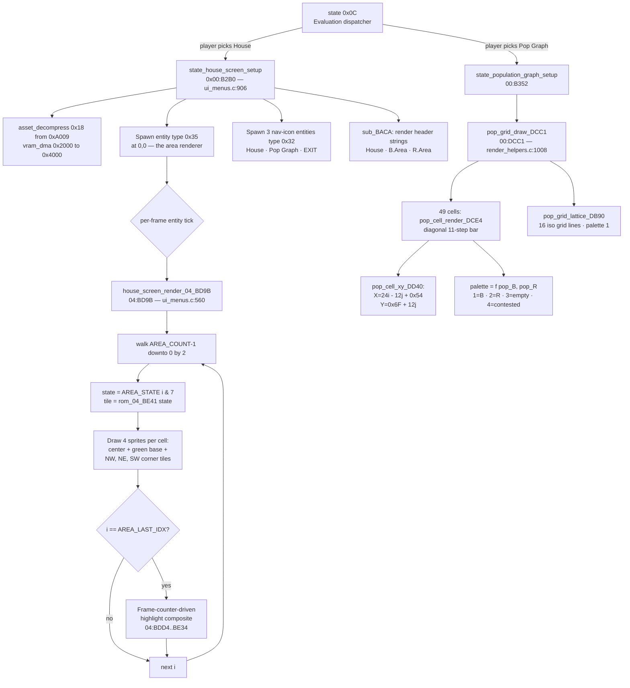

# House Screen (Evaluation → House)

> **Manual reference:** pp. 29–30 ("Evaluation Screens — House",
> "Population Graph"). Not directly named in the manual; what the
> manual calls **House Screen** is one of three sub-screens reached
> via the **Evaluation icon** in the in-game toolbar.
>
> **Source:** [`ui_menus.c`](../ui_menus.c) and
> [`render_helpers.c`](../render_helpers.c).
> Every routine cross-references a precise line + ROM address.

## 1. Where it Sits in the Game State Machine

The Evaluation icon launches game-state **`$0C`** (the evaluation
sub-dispatcher) — see [`ui_menus.c:94-100`](../ui_menus.c) for the
icon menu (`magic = 0x29` → submenu at `$01:88F9`).

State `$0C` then routes to one of three sub-screens depending on the
player's pick:

| State idx | Address     | Sub-screen                                |
| --------- | ----------- | ----------------------------------------- |
| `$0E`     | `$00:B2B0`  | **House** (the 7×7 area-map; this page)   |
| `$0F`     | `$00:B352`  | **Population Graph** (isometric bar grid) |
| `$10`     | `$00:B47C`  | **History Graph** (10-metric time series) |
| `$11`     | `$00:B490`  | **Status Screen** (6 percentages)         |

See [`ui_menus.c:864-883`](../ui_menus.c).

This page documents the **House** sub-screen and the **Population
Graph** (which renders the same 49-area data as iso bars instead of
flat tiles).

## 2. House Screen Setup

`state_house_screen_setup` ([`ui_menus.c:906`](../ui_menus.c), ROM
`$00:B2B0`) sets up the screen as follows:

1. Force-blank PPU; decompress House-screen background (24 tile blocks
   from ROM `$A009`) into VRAM `$4000`.
2. Spawn the area-state drawer **entity type `0x35` (53)** at `(0,0)`.
   This is the per-frame renderer documented in §3.
3. Spawn the 3 bottom-of-screen nav icons (entity type `0x32`) at the
   layout from `eval_nav_icons[]` ([`ui_menus.c:606`](../ui_menus.c)):
   `(80,200) House`, `(128,200) Population Graph`, `(176,200) EXIT`.
4. Call `sub_BACA(0x03, 0xA009)` to render the "House  B.Area  R.Area"
   header strings.
5. Bump `dp[$0B]` to advance into the run-loop state.

## 3. House Renderer (entity type `0x35`)

`house_screen_render_04_BD9B` ([`ui_menus.c:560`](../ui_menus.c),
ROM `$04:BD9B`). Runs each frame while the House screen is up.

Walks the live-area list (`LIVE_AREA_COUNT` at `$7F:E87E`) in **reverse**
so the highest index (the *current* area) draws on top:

```c
for (i = AREA_COUNT-1; i >= 0; i -= 2) {
    px = AREA_X_TABLE[i] << 4;      // *16 pixels per area
    py = AREA_Y_TABLE[i] << 4;
    state = AREA_STATE[i] & 7;
    tile  = rom_04_BE41_area_tile[state];
    // Composite the 4-sprite 32×32 area cell:
    draw(px,    py,    tile);                       // colored center
    draw(px,    py,    0x42, 0x95);                 // green base
    draw(px-16, py-16, 0x20);                       // NW corner
    draw(px+16, py-16, 0x24);                       // NE corner
    draw(px-16, py+16, 0x60);                       // SW corner
}
```

The per-state tile table at ROM `$04:BE41` (8 bytes):

```
{ 0x42, 0x48, 0x4A, 0x48, 0x4A, 0x4C, 0x4E, 0x48 }
```

Colour-mapped per the manual's p.30 description:

| state | tile  | colour      |
| ----- | ----- | ----------- |
| 0     | `$42` | green       |
| 1, 3  | `$48` | black       |
| 2, 4  | `$4A` | red         |
| 5     | `$4C` | striped v1  |
| 6     | `$4E` | striped v2  |

## 4. The "Current Area Flashes" Effect

The manual specifies the *current* area should **flash**. Earlier guesses
mapped this to bit 7 of the `AREA_STATE` byte; **V4-8 refuted** this — see
[`territory.c:108-126`](../territory.c).

The actual mechanism: after the reverse-walk in §3 finishes, an additional
compositing pass at ROM `$04:BDD4..BE34` draws 4 extra sprites
(`0x95+0x20+0x42+0x24`) at ±16 px around the **`AREA_LAST_IDX`** entry,
using palette animation keyed to the global frame counter. The state byte
of the current entry is unmodified — the highlight is purely a
renderer-side overlay on the topmost (highest-index) live area.

## 5. Population Graph (sub-screen 2)

The Population Graph renders the **same 49-area data** but as 7×7
**isometric bars** instead of flat tiles. This is the canonical view of
the world state — directly reads `AREA_B_POP_MAP` (`$7E:EA46`) and
`AREA_R_POP_MAP` (`$7E:EAC6`).

Driver: `pop_grid_draw_DCC1` ([`render_helpers.c:1008`](../render_helpers.c),
ROM `$00:DCC1`).

### 5a. Per-Cell Coordinate Transform — `$00:DD40`

`pop_cell_xy_DD40` ([`render_helpers.c:922`](../render_helpers.c)):

```c
X = 24*i - 12*j + 0x54     // base offset 0x54 = 84 px
Y = 0x6F + 12*j            // base offset 0x6F = 111 px
```

Varying `i` (row index) moves cells **horizontally** along the (+24, 0)
axis; varying `j` (col index) moves cells **diagonally** along the
(−12, +12) axis — the canonical 2:1 isometric ratio.

### 5b. Per-Cell Palette Selection — `$00:DCE4`

`pop_cell_render_DCE4` ([`render_helpers.c:938`](../render_helpers.c))
reads `(pop_B, pop_R)` for cell `(i, j)` and picks:

| `pop_B` | `pop_R` | palette | meaning   |
| ------- | ------- | ------- | --------- |
| 0       | 0       | 3       | empty     |
| > 0     | 0       | 1       | B-only    |
| 0       | > 0     | 2       | R-only    |
| > 0     | > 0     | 4       | contested |

For palette 4 (contested), the bar is **striped** by toggling the alt-mask
via `sub_490E2` ([`render_helpers.c:972`](../render_helpers.c)) every
other pixel row.

### 5c. Bar Renderer (DIAGONAL — corrected by V2-D)

`pop_cell_render_DCE4` walks an **11-step diagonal** from the cell's
base point. Each step: `X -= 1`, `Y += 1`, then plot at `(px + 0x17, py)`.

> **V2-D fix**: an earlier reconstruction drew vertical bars (`Y += 1`,
> `X` constant). Inspection of the ROM's `DEX/INY` pair at `$00:DCFE`
> showed both registers stepping each iteration — i.e. **diagonal**
> bars matching the isometric grid lines, not vertical ones.

### 5d. Lattice Lines — `$00:DB90`

`pop_grid_lattice_DB90` ([`render_helpers.c:989`](../render_helpers.c))
draws the 16 grid lines (8 "horizontal" + 8 "vertical" in iso-space) using
palette 1.

> **V2-D fix (palette swap)**: an earlier version drew the lattice with
> palette 4 and the cell bars with palette 1 — making the grid pop and
> bars disappear. The ROM order at `$00:DB90` is `sub_490E0(1)` for the
> lattice and per-cell palette select inside `pop_cell_render_DCE4` —
> i.e. **lattice = palette 1**, **diagonal cell bars = the per-cell
> palette (1/2/3/4)**.

## 6. Click-to-Move Gate

When the player clicks an area on the House screen, the cursor-idle
handler at `$00:D480..D4CD` walks the per-area message scratch at
`dp[$45..$50]`; if the clicked area is **R-only**, message code `18`
fires, which dispatches through `$00:DFCD` to the string at `$01:A550`:

> *"You can only enter areas with black ant colonies."*

The valid-target predicate is `house_can_move_to_clicked` in
[`territory.c:764`](../territory.c). In the SNES port however,
**no actual area transition happens** — `CUR_AREA_X` / `CUR_AREA_Y` are
never written, so the "move" is purely a visual cue (re-centering of the
House-screen cursor highlight on the clicked tile). See
[`territory.c:780-810`](../territory.c) for the full V3 finding.

## 7. House Tally Headers

`house_compute_tallies` ([`ui_menus.c:625`](../ui_menus.c)) computes the
"B.Area" / "R.Area" counters at the top-right of the screen:

```c
b_area = #live_areas with STATE in {BLACK, STRIPED}
r_area = #live_areas with STATE in {RED,   STRIPED}
```

These are 2-digit numbers drawn through the standard digit-sprite pipeline.

## 8. Mermaid: House Screen Render Pipeline



## 9. Symbol / Address Index

| ROM address      | Function (file:line)                                                  | Role                              |
| ---------------- | --------------------------------------------------------------------- | --------------------------------- |
| `$00:B2B0`       | `state_house_screen_setup` ([`ui_menus.c:906`](../ui_menus.c))          | State `$0E` setup                 |
| `$04:BD9B`       | `house_screen_render_04_BD9B` ([`ui_menus.c:560`](../ui_menus.c))      | Per-frame 49-area composite       |
| `$04:BE41`       | `rom_04_BE41_area_tile[8]` ([`ui_menus.c:558`](../ui_menus.c))         | State → tile mapping              |
| `$04:BDD4`       | (documented) flashing-overlay pass                                    | "Current area" animation           |
| `$03:96B0`       | `house_area_append_039_6B0` ([`ui_menus.c:531`](../ui_menus.c))        | Append new live area              |
| `$00:DCC1`       | `pop_grid_draw_DCC1` ([`render_helpers.c:1008`](../render_helpers.c))  | Population Graph entry            |
| `$00:DCE4`       | `pop_cell_render_DCE4` ([`render_helpers.c:938`](../render_helpers.c)) | Render one iso bar cell           |
| `$00:DD40`       | `pop_cell_xy_DD40` ([`render_helpers.c:922`](../render_helpers.c))     | i,j → (px,py) iso transform       |
| `$00:DB90`       | `pop_grid_lattice_DB90` ([`render_helpers.c:989`](../render_helpers.c))| Grid lattice lines (palette 1)    |
| `$04:90E0`       | `sub_490E0(a)`                                                        | Set BG3 plot palette              |
| `$04:90E2`       | `sub_490E2(a)`                                                        | Set BG3 alt-mask (striped fill)   |
| `$01:A550`       | (string)                                                              | "You can only enter areas..."     |

## 10. Cross-References

* **Underlying data**: `wiki/10-territory-49areas.md`.
* **Click-gate logic**: `territory.c:house_can_move_to_clicked()`.
* **History Graph / Status Screen** (the other two Evaluation
  sub-screens): `ui_menus.c:state_history_graph_setup()` and
  `ui_menus.c:state_status_screen_setup()`.
