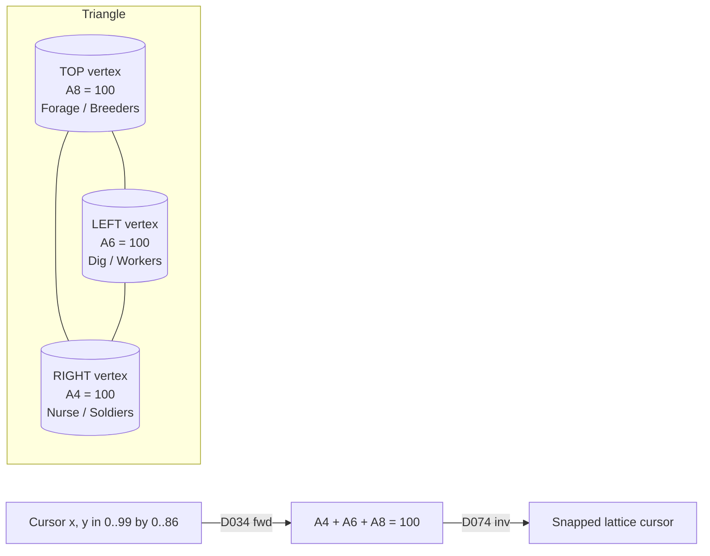
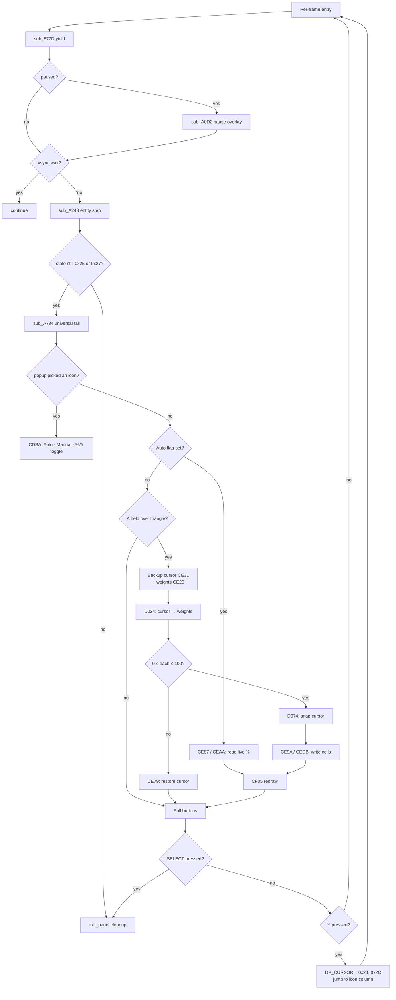

# Control Panels: Behavior & Caste Triangle Joysticks

> **Manual reference:** pp. 14–16 ("Control Panel — Behavior", "Caste").
> **Source:** [`control_panels.c`](../control_panels.c). Every routine
> cross-references a precise line + ROM address.

## 1. What the Player Sees

Two near-identical UI panels reachable via the **Control Panel icon**
(icon #2, magic `$2B`) → submenu at `$01:8809`:

| Submenu pick | State setup | State run | Function     |
| ------------ | ----------- | --------- | ------------ |
| **Behavior** | `$24`       | `$25`     | Forage / Dig / Nurse balance |
| **Caste**    | `$26`       | `$27`     | Workers / Soldiers / Breeders balance |

> **Naming correction (V4-8):** earlier audit notes wrongly identified
> states `$24/$25` as a "nest close-up" view. The lifted body at
> `$00:CA96` clearly initialises Behavior or Caste panel layout
> depending on `dp[$0B]`, and the joystick math at `$00:D034/D074`
> is shared by both — see
> [`control_panels.c:945-948`](../control_panels.c).

Each panel features:

* A **triangle joystick** — a 100×87 px equilateral triangle whose
  three vertices each represent one role/caste. The player drags a
  cross-cursor inside the triangle to set the three percentages.
* Three percentage readouts (one per vertex). In **Percent** mode these
  show the working weights 0..100; in **Absolute** mode they show
  population counts (`pct × COLONY_TOTAL_POP / 100`).
* An **Auto / Manual** toggle icon. In Auto mode the panel mirrors the
  live simulation state; in Manual mode the player's setting overrides it.

## 2. Triangle Math — The Joystick's Core

The triangle uses **oblique barycentric coordinates**, fast-pathed via
the SNES hardware multiply/divide trampolines.

### 2a. Forward: Cursor → Percentages (`sub_D034`)

ROM `$00:D034`, lifted at [`control_panels.c:227`](../control_panels.c)
as `cp_triangle_xy_to_weights_D034()`.

Input: triangle-space cursor `($9E, $A0)` ∈ `[0..99] × [0..86]`.
Output: three weights `(A4, A6, A8)` at `dp[$A4]..$A8`, each `0..100`,
summing to exactly 100.

```c
scaled_y = (y * 65536) / 113511;       // = y / √3,  113511 = 0x1BB67
A4 (RIGHT) =       x - scaled_y;       // Nurse / Soldiers
A6 (LEFT ) = 100 - x - scaled_y;       // Dig    / Workers
A8 (TOP  ) = 100 - A4 - A6;            // Forage / Breeders   (= 2*scaled_y)
```

The constant `113511 = 0x1BB67` is `65536 × √3`. The division is the
SNES's `$4214/$4216` integer trampoline (`sub_8D41`); the multiply is
`sub_8D05` (32×32→64).

### 2b. Inverse: Percentages → Cursor (`sub_D074`)

ROM `$00:D074`, lifted at [`control_panels.c:263`](../control_panels.c)
as `cp_triangle_weights_to_xy_D074()`.

Input: weights `(A4, A6, A8)`. Output: cursor `($9E, $A0)`.

```c
cursor_x = A4 + (A8 >> 1);                 // x = right + top/2
cursor_y = (A8 * 0x1BB67) >> 17;           // y = A8 * √3 / 2 ≈ A8 × 0.866
```

The right-shift-by-17 is "multiply by 0x1BB67, take bits 16..31, then
LSR" — i.e. divide by `2 × 65536 / 113511 = 2/√3`.

> **Snap behaviour**: every time the player moves the cursor, the run
> loop calls `D034` to map cursor→weights, validates `0 ≤ each ≤ 100`,
> then calls `D074` to **snap the cursor back** to the exact integer-
> lattice point that represents those weights. This is what gives the
> joystick its "click into place" feel.

### 2c. Geometry Diagram



Pixel layout on screen (both panels share the same rectangle):

```
        TOP  (50, 86) ← in triangle space
              /\
             /  \
            /    \         triangle origin in screen pixels:
           /      \           base-X = $4E = 78
   LEFT  /________\ RIGHT     base-Y = $A7 = 167
       (0, 0)   (99, 0)

   screen_X = base-X + cursor_x = 78 + ($9E)
   screen_Y = base-Y - cursor_y = 167 - ($A0)
```

## 3. WRAM Layout

All cells are 16-bit (the lift uses `REP #$20` consistently); values
are `0..100` for percentages.

### 3a. Auto/Manual Flags

| Address | Cell | Default | Meaning |
| ------- | ---- | ------- | ------- |
| `$0286` | `CP_BEHAVIOR_AUTO` | 1 | 0 = Manual, 1 = Auto |
| `$0288` | `CP_CASTE_AUTO`    | 1 | 0 = Manual, 1 = Auto |

### 3b. Behavior Percentages (Forage / Dig / Nurse)

| Address  | Cell           | Default | Vertex | Manual role  |
| -------- | -------------- | ------- | ------ | ------------ |
| `$028A`  | `CP_BHV_TOP`   | 60      | TOP    | **Forage**   |
| `$028C`  | `CP_BHV_LEFT`  | 20      | LEFT   | **Dig**      |
| `$028E`  | `CP_BHV_RIGHT` | 20      | RIGHT  | **Nurse**    |

### 3c. Caste Percentages (Workers / Soldiers / Breeders)

| Address  | Cell             | Vertex | Manual role  |
| -------- | ---------------- | ------ | ------------ |
| `$0290`  | `CP_CASTE_LEFT`  | LEFT   | **Workers**  |
| `$0292`  | `CP_CASTE_RIGHT` | RIGHT  | **Soldiers** |
| `$0294`  | `CP_CASTE_TOP`   | TOP    | **Breeders** |

### 3d. Raw Colony Cells (Caste auto-pack source)

| Address  | Cell                   | Default | Notes |
| -------- | ---------------------- | ------- | ----- |
| `$027E`  | `CP_COLONY_WORKERS`    | 60      | live count |
| `$0280`  | `CP_COLONY_SOLDIERS`   | 40      | live count |
| `$0282`  | `CP_COLONY_BREEDERS_A` | 0       | breeders half-A (e.g. males) |
| `$0284`  | `CP_COLONY_BREEDERS_B` | 0       | breeders half-B (e.g. females) |

The Caste auto-pack at `$00:CEC0`
([`control_panels.c:379`](../control_panels.c)) sums the two breeder
halves into `CP_CASTE_TOP = $0282 + $0284`. The Caste Manual commit at
`$00:CEDB` ([`control_panels.c:406`](../control_panels.c)) mirrors back
by writing the new TOP weight, halved, into both `$0282` and `$0284`.

### 3e. Scratch Cells (cursor & math)

| Address     | Purpose                                            |
| ----------- | -------------------------------------------------- |
| `$14/$15`   | Screen-pixel cursor (set by the cursor entity)     |
| `$9E/$A0`   | Triangle-space cursor (8-bit live, 16-bit access)  |
| `$9A/$9C`   | Saved triangle-cursor (for restore-on-invalid)     |
| `$A4/$A6/$A8` | Working weights (RIGHT/LEFT/TOP)                 |
| `$AA/$AC/$AE` | Backup of working weights                        |
| `$BE..$C8`  | 32-bit mul/div scratch (D034 / D074 / CFB9)        |

## 4. Auto vs Manual Mode

The Auto/Manual flag is **not** an auto-balancing algorithm — it's a
**direction-of-data-flow switch**.

### 4a. Auto Mode (flag = 1)

The panel just **DISPLAYS** the live simulation values:

* `cp_behavior_load_for_display_CE87` ([`control_panels.c:353`](../control_panels.c))
  copies `$028A/$028C/$028E` → `A4/A6/A8` and snaps the cursor.
* `cp_caste_load_for_display_CEAA` ([`control_panels.c:391`](../control_panels.c))
  first repacks `$027E..$0284` → `$0290..$0294` via CEC0, then snaps.

In Auto mode the simulation tick continuously updates the raw colony cells;
the panel just renders the latest snapshot every frame.

### 4b. Manual Mode (flag = 0)

The panel **WRITES** the percentage cells when the player drags:

* Press and hold A inside the triangle → triangle-space cursor goes
  through `D034 → validate → D074 (snap)`.
* On valid drag:
  - `cp_behavior_commit_CE9A` ([`control_panels.c:366`](../control_panels.c))
    writes `A4/A6/A8` → `$028E/$028C/$028A`, OR
  - `cp_caste_commit_CEDB` ([`control_panels.c:406`](../control_panels.c))
    writes `A4/A6/A8` → `$0292/$0290/$0294` AND mirrors back to
    `$027E/$0280` and `$0282/$0284 = $0294 / 2`.

The Caste-mirror is what makes Manual mode actually re-target the
colony — the simulation reads `$027E/$0280/$0282/$0284` to drive caste
production. See [`control_panels.c:807-856`](../control_panels.c) for
the full "Auto-mode policy" discussion.

## 5. Per-Frame Run Loop (`sub_CCD0`)

ROM `$00:CCD0`, lifted at [`control_panels.c:730`](../control_panels.c)
as `cp_state_run_CCD0()`. Drives both state `$25` (Behavior) and `$27`
(Caste); the function branches on `DP_STATE` everywhere it needs the
per-panel cell addresses.



## 6. The "%" vs "# of ants" Display Toggle

Cell `$0044` (`CP_PCT_DISPLAY`) flips display mode. Shared between
both panels — the same icon clicks for both Behavior and Caste.

* **Percent mode** (`$0044 != 0`): the three drawn numbers are literally
  `A4 / A6 / A8` (the working weights).
* **Absolute mode** (`$0044 == 0`): the run-loop temporarily replaces
  `A4 / A6 / A8` with `pct_to_count(percent) = (% × total_pop) / 100`,
  draws those, then restores the working weights from the backup.
  `total_pop` is `COLONY_TOTAL_POP_7FEB60` at `$7E:EB60`.

See `cp_redraw_CF05` ([`control_panels.c:494`](../control_panels.c)) and
the count converter `cp_pct_to_count_CFB9` ([`control_panels.c:429`](../control_panels.c)).

## 7. Initial Seed (state `$1A`)

`cp_seed_initial_9700` ([`control_panels.c:921`](../control_panels.c),
ROM `$00:9700..9745`) runs once at new-game / load-from-empty:

```c
CP_BEHAVIOR_AUTO = 1;
CP_CASTE_AUTO    = 1;

CP_BHV_TOP  = 60;   // Forage
CP_BHV_LEFT = 20;   // Dig
CP_BHV_RIGHT= 20;   // Nurse

CP_COLONY_WORKERS    = 60;
CP_COLONY_SOLDIERS   = 40;
CP_COLONY_BREEDERS_A = 0;
CP_COLONY_BREEDERS_B = 0;
```

Matches the manual's documented defaults exactly.

## 8. Symbol / Address Index

| ROM address | Function (`control_panels.c` line)                          | Role                                    |
| ----------- | ----------------------------------------------------------- | --------------------------------------- |
| `$00:CA96`  | `cp_state_setup_CA96` (state `$24/$26` setup)               | Panel BG load, spawn icons              |
| `$00:CCD0`  | `cp_state_run_CCD0` ([:730](../control_panels.c))           | Per-frame run loop (states `$25/$27`)   |
| `$00:CDBA`  | `cp_substate_table_CDBA[]`                                  | Auto / Manual / %-# icon dispatch       |
| `$00:CDC6`  | `cp_substate_auto_CDC6` ([:530](../control_panels.c))       | Auto-icon clicked                       |
| `$00:CDE5`  | `cp_substate_manual_CDE5` ([:541](../control_panels.c))     | Manual-icon clicked                     |
| `$00:CE20`  | `cp_backup_weights_CE20`                                    | Backup A4/A6/A8 → AA/AC/AE              |
| `$00:CE31`  | `cp_backup_cursor_CE31`                                     | Backup `$9E/$A0` → `$9A/$9C`            |
| `$00:CE3E`  | `cp_validate_weights_CE3E` ([:310](../control_panels.c))    | Validate ≤ 100                          |
| `$00:CE6B`  | `cp_cursor_in_bounds_CE6B` ([:333](../control_panels.c))    | Validate cursor in triangle             |
| `$00:CE87`  | `cp_behavior_load_for_display_CE87` ([:353](../control_panels.c)) | Behavior auto-load              |
| `$00:CE9A`  | `cp_behavior_commit_CE9A` ([:366](../control_panels.c))     | Behavior manual-commit                  |
| `$00:CEAA`  | `cp_caste_load_for_display_CEAA` ([:391](../control_panels.c)) | Caste auto-load                       |
| `$00:CEC0`  | `cp_caste_auto_pack_CEC0` ([:379](../control_panels.c))     | Caste auto-pack (sum breeder halves)    |
| `$00:CEDB`  | `cp_caste_commit_CEDB` ([:406](../control_panels.c))        | Caste manual-commit (+ mirror back)     |
| `$00:CF05`  | `cp_redraw_CF05` ([:494](../control_panels.c))              | Per-frame redraw (%-or-count switch)    |
| `$00:CFB9`  | `cp_pct_to_count_CFB9` ([:429](../control_panels.c))        | percent × pop / 100                     |
| `$00:D034`  | `cp_triangle_xy_to_weights_D034` ([:227](../control_panels.c)) | **Forward triangle map**             |
| `$00:D074`  | `cp_triangle_weights_to_xy_D074` ([:263](../control_panels.c)) | **Inverse triangle map (snap)**      |
| `$00:8D05`  | `sub_8D05`                                                  | 32×32→64-bit mul (used by D074)         |
| `$00:8D41`  | `sub_8D41`                                                  | 32÷32→32-bit div (used by D034)         |
| `$00:9187`  | `sub_9187_popup`                                            | Submenu popup helper                    |
| `$00:9700`  | `cp_seed_initial_9700` ([:921](../control_panels.c))        | State-`$1A` defaults seed                |
| `$01:8800`  | Control-Panel submenu data                                  | `count=02, [Behavior], [Caste]`         |
| `$04:9DD5`  | Auto/Manual icon handler T1 (Behavior)                      | Entity step                              |
| `$04:9DEA`  | Auto/Manual icon handler T2 (Caste)                         | Entity step                              |

## 9. Cross-References

* **Where the persistent cells are read** by the simulation: see
  `control_panels.c:807-856` ("AUTO-MODE policy" section) and
  the entity step in `entities_a..g.c` (caste-production tick).
* **Submenu wiring** (icon #2 → state `$24` or `$26`): see
  `ui_menus.c:icon_menu_vertical[]` and `control_panels.c:897`
  (`cp_icon2_control_pick`).
* **House Screen** (the other major in-game panel): `wiki/11-house-screen-ui.md`.
* **Per-area territory data** (which the Caste/Behavior settings indirectly
  shape via the simulation): `wiki/10-territory-49areas.md`.
