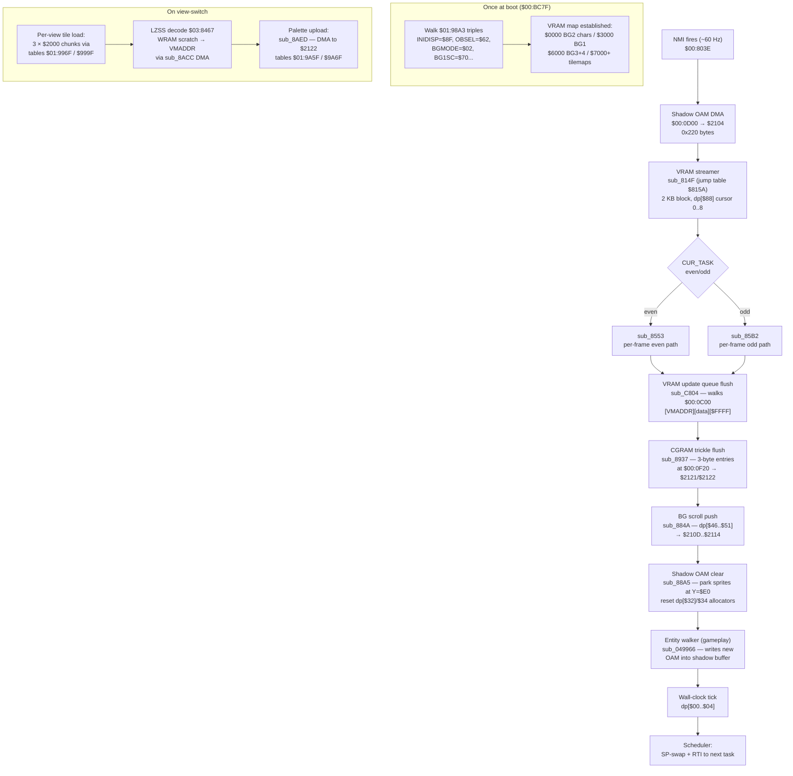

# 16 — Rendering Pipeline: PPU init, VRAM streaming, OAM, palette, LZSS

This page documents the SimAnt SNES rendering subsystem end-to-end: how
the PPU is initialised at boot, how VRAM is fed at runtime, how sprites
reach the screen via shadow OAM + DMA, how palettes are uploaded to
CGRAM, and how the LZSS-packed art assets are decompressed on the way
in. None of this is in the player manual — it is all reconstructed from
the disassembly.

For the boot/NMI/scheduler frame around all of this, see
[01 — Architecture](01-architecture.md). The two pages share the NMI
handler at `$00:803E` as their interface boundary: rendering is the
work the NMI does **before** the scheduler hands time back to gameplay
tasks.

Manual cross-reference: pages 4-7 ("Getting Started", "Using the
Controls") describe how the screens **look** ("six views", "menu
overlays", "control panels"). The manual is silent on **how** those
pixels arrive — that is this page.

---

## 1. PPU boot init — `$00:BC7F` interprets the table at `$01:98A3`

The boot driver (`main_9340` -> `boot_init_BB8D`, see
[01-architecture.md](01-architecture.md)) calls `ppu_init_apply_BC7F`
**once** during force-blank. The routine walks a zero-terminated table
of register-write triples at ROM `$01:98A3`. Each triple is
`[reg_lo, reg_hi, value]` where `reg_lo|reg_hi` is the literal PPU
register address (`$2100..$21FF`) and `value` is the byte to store.

The lifted table (see `misc_helpers.c:56-83`):

| Triple | Register | Value | Meaning |
|--------|----------|-------|---------|
| 0  | `INIDISP $2100`   | `$8F` | force blank on, brightness 15 (kept until first fade-in) |
| 1  | `OBSEL $2101`     | `$62` | sprite size pair = 8x8 / 32x32, sprite tilebase = VRAM `$2000` |
| 4  | `BGMODE $2105`    | `$02` | mode 2 (two 4-bpp BGs + offset-per-tile from BG3), BG3 priority |
| 6  | `BG1SC $2107`     | `$70` | BG1 tilemap @ VRAM `$7000`, 32x32 |
| 7  | `BG2SC $2108`     | `$74` | BG2 tilemap @ VRAM `$7400`, 32x32 |
| 8  | `BG3SC $2109`     | `$78` | BG3 tilemap @ VRAM `$7800`, 32x32 |
| 9  | `BG4SC $210A`     | `$7C` | BG4 tilemap @ VRAM `$7C00`, 32x32 |
| 10 | `BG12NBA $210B`   | `$30` | BG1 chars @ `$3000`, BG2 chars @ `$0000` |
| 11 | `BG34NBA $210C`   | `$66` | BG3 chars @ `$6000`, BG4 chars @ `$6000` (shared) |

Reference: `misc_helpers.c:23-100` (`ppu_init_apply_BC7F`).

The implied VRAM map after PPU init:

```
$0000-$2FFF   BG2 character data (4-bpp, 192 tiles per 0x1000 block)
$3000-$5FFF   BG1 character data
$6000-$6FFF   BG3 + BG4 shared character data
$7000-$7FFF   four 32x32 tilemaps (BG1..BG4 stacked at $7000/$7400/$7800/$7C00)
$2000-$2FFF   sprite character data (overlaps BG2 — see note)
```

The sprite/BG2 overlap is intentional: SimAnt uses mode 2, where BG3 is
fed by offset-per-tile data from BG3's tiles, so BG2 only ever needs
its low 4 KB. The bank `$3000` BG1 chars and `$2000` sprite chars are
both kept live; the streamer below carefully writes into both windows
without trampling.

---

## 2. VRAM streamer — `$00:814F` and the 8-block jump table

Each NMI, exactly **one** 2-KB block is DMA'd from a fixed WRAM source
to a fixed VRAM destination. The streamer is driven by `dp[$88]`, a
cursor that walks `1..8` (with `0` meaning "no transfer this frame").
The jump table at ROM `$815A` indexes one entry per cursor value:

| `dp[$88]` | WRAM src | VRAM dst | Notes |
|-----------|----------|----------|-------|
| 0         | —        | —        | `$81A4` is a bare RTS (skip frame) |
| 1         | `$3000`  | `$0800`  | BG1 chars, slice 0 |
| 2         | `$3800`  | `$0C00`  | BG1 chars, slice 1 |
| 3         | `$4000`  | `$1000`  | BG1 chars, slice 2 |
| 4         | `$4800`  | `$1400`  | BG1 chars, slice 3 |
| 5         | `$5000`  | `$1800`  | BG1 chars, slice 4 |
| 6         | `$5800`  | `$1C00`  | BG1 chars, slice 5 |
| 7         | `$6000`  | `$2000`  | BG3/4 + sprite-char overlap, slice 0 |
| 8         | `$6800`  | `$2400`  | BG3/4 + sprite-char overlap, slice 1 |

After 8 frames (= ~133 ms) the entire BG layer has been refreshed. The
cursor is bumped by `sub_E527` (see `simant.c:504-527` for the lifted
`vram_stream_step_814F`). Setting `dp[$88] = 0` is how the engine
freezes asset upload while a slower one-shot DMA finishes elsewhere.

The shared DMA-trigger tail at `$821A` programs:

```
DMA0_PARAM = $01    ; CPU->PPU, fixed source, word-mode
DMA0_DEST  = $18    ; B-bus = $2118 (VMDATAL/H)
DMA0_BANK  = $00
DMA0_LEN   = $0800  ; 2 KB
MDMAEN     = $01    ; fire
```

---

## 3. VRAM update queue — `$00:0C00` + `sub_C804`

For per-frame "small fixup" writes (HUD digits, scroll-position tile
updates, the cursor sprite, etc.), the engine maintains a free-form
queue in WRAM at `$00:0C00`. Each batch is:

```
[VMADDR_word][data_word]*[$FFFF terminator]
```

`dp[$2C..$2D]` holds the total length in **bytes**. Producers append
batches; `vram_queue_flush_C804` walks them each NMI:

```c
/* simant.c:538-555 */
static void vram_queue_flush_C804(void)
{
    uint16_t end = *(uint16_t *)&dp[0x2C];
    if (end == 0) return;
    uint16_t *q = (uint16_t *)&wram[0x0C00];
    unsigned i = 0;
    while (i*2 < end) {
        VMADDL = q[i++];
        while (i*2 < end) {
            uint16_t w = q[i++];
            if (w == 0xFFFF) break;
            /* write w to VMDATAL/H */
        }
    }
    *(uint16_t *)&dp[0x2C] = 0;
}
```

This is the **only** way gameplay code touches VRAM between the
streamer's 8-block cycle and a force-blank one-shot load.

---

## 4. Shadow OAM + DMA — `$00:0D00`

OAM is double-buffered in WRAM. The shadow buffer at `$00:0D00` is
0x220 bytes — `0x200` for the 128 sprite quadruplets + `0x20` for the
high-OAM size/MSB-X bits.

The NMI handler's **first** DMA pushes the whole buffer to OAM (port
`$2104`) in one burst:

```c
/* simant.c:453-459 (inside nmi()) */
DMA0_PARAM = 0x00;   /* CPU->PPU, increment src, byte mode */
DMA0_DEST  = 0x04;   /* $2104 = OAMDATA */
DMA0_SRC   = 0x0D00;
DMA0_BANK  = 0x00;
DMA0_LEN   = 0x0220;
MDMAEN     = 0x01;
```

Two OAM allocators carve up the buffer for the rest of the frame:

| DP word        | Allocator     | Boot value | Range            |
|----------------|---------------|------------|------------------|
| `dp[$32..$33]` | hi-priority   | `$0010`    | `$0D10..$0D0F`-ish (front sprites) |
| `dp[$34..$35]` | lo-priority   | `$0110`    | `$0E10..$0EFF`-ish (back sprites)  |

`shadow_oam_clear_88A5` (see `simant.c:611-624`) parks all 128 sprites
at Y = `$E0` (off-screen below the visible 224-line frame) and resets
both allocators each frame. Sprites that the gameplay code wants
visible must re-emit themselves every frame; sprites that nobody
re-emits silently disappear next NMI.

---

## 5. BG scroll shadow — `dp[$46..$51]` + `sub_884A`

The six BG H/V scroll registers (`$210D..$2114`) are write-twice
(low-byte then high-byte) and not readable. The engine keeps a shadow
at `dp[$46..$51]`:

```
dp[$46/$47]  BG1HOFS / BG1VOFS  (2 bytes each)
dp[$48..$4B] BG2  scroll
dp[$4C..$4F] BG3  scroll
dp[$50..$51] BG4  scroll (one axis only — BG4 unused in mode 2)
```

`bg_scroll_push_884A` (`simant.c:598-606`) pushes all six values every
NMI. Gameplay code just writes the shadow.

---

## 6. Per-view tile + palette tables — `$01:996F` / `$01:9A5F`

SimAnt has **16 view-modes** (the 8 scenarios × 2 nest factions: Black
overview, Black close-up, Red overview, Red close-up). Each view has
its own tile-character set and palette set, packed in ROM.

Two parallel dispatch tables:

```
$01:996F  per_view_tile_bank[16][3]   (source bank byte for 3 chunks per view)
$01:999F  per_view_tile_src[16][3]    (16-bit ROM offset within that bank)
```

Each chunk is `$2000` bytes uncompressed. A view's three chunks fill
its BG character window (`$3000-$8FFF`). Verified in `assets.c:326-365`.

The palette half lives at:

```
$01:9A5F  per_view_palette_bank[16][3]
$01:9A6F  per_view_palette_src[16][3]
```

Each palette chunk decompresses to `$2000` bytes (one CGRAM frame +
animated cycling tables).

---

## 7. CGRAM palette upload — `sub_8AED` ($00:8AED)

CGRAM is 512 bytes (256 × 2-byte BGR555). Bulk palette upload uses
DMA channel 0 to port `$2122` (CGDATA), with `$2121` (CGADD) pre-set.
The lifted helper at `$00:8AED` (extern decl in `render_helpers.c:98`)
takes `A` = byte count, `Y` = WRAM source offset.

For per-color CGRAM "trickle" updates (animated palette cycling, HUD
flashes), the engine uses the CGRAM update queue at `$00:0F20`,
flushed by `sub_8937` each NMI. Each entry is 3 bytes:
`[CGADD index, color low, color high]`. See `simant.c:556-595`.

---

## 8. LZSS decompressor — `$03:8467`

All compressed art (43 blobs across banks `$07/$10/$15-$19`) uses one
custom LZSS variant. The decoder is faithful to the ROM, verified by
re-running `asset_extract.py` on every blob.

**Format:**

```
Header (4 bytes):
  [0..1]  uncompressed length (little-endian)
  [2..3]  reserved (skipped)

Body: groups of 1 control byte + up to 8 sub-units (MSB-first).
  bit = 0 -> emit 1 literal byte from source
  bit = 1 -> back-reference (2 bytes from source, packed 12+4):
              offset_back = (B >> 4) & 0x0FFF    ; 0..4095 bytes back
              length      = (B & 0x0F) + 3       ; 3..18 bytes copied
              copy from out_pos-1-offset_back to out_pos
```

The lift (`simant.c:897-925`) is the spec. The original uses a clever
`ASL` on a 16-bit register pre-seeded with `$FF00`, so when the low
byte's 8 control bits have been consumed the high `$FF` underflows
into the carry — that's the "fetch next control byte" signal. The C
lift just counts bits explicitly.

**Verified against all 43 LZSS assets** by re-running the decoder in
`asset_extract.py`; every blob decompresses to the length declared in
its 4-byte header. See `assets.c:117-150` for the format restatement
and `ASSET_VERIFY_RESULTS.md` for the verification log.

---

## 9. NMI rendering pipeline diagram



---

## 10. Inline pointers

Code annotations that reference this page:

- `simant.c:nmi` (`simant.c:455`) — "See wiki/16-rendering-pipeline.md
  for the full NMI rendering pipeline"
- `simant.c:lz_decompress_03_8467` (`simant.c:897`) — "See
  wiki/16-rendering-pipeline.md §8 LZSS format"

---

## 11. Manual references

- **Pages 4-7** describe what the player sees (six views, HUD icons,
  fade transitions). The manual is silent on the underlying VRAM/OAM
  pipeline, the per-view art system, and the LZSS codec — all of which
  are necessary to faithfully reproduce the rendering. This page is
  the missing engineering complement.
- Mode 2 + BG3-priority + 8x8/32x32 sprite-size pair is a fairly
  unusual SNES configuration; it is exactly the setup that lets
  SimAnt render large tutorial-screen sprites (32x32 ants on the
  encyclopedia) on the same hardware as the 8x8 in-game ant tiles
  without re-uploading the sprite character set.
