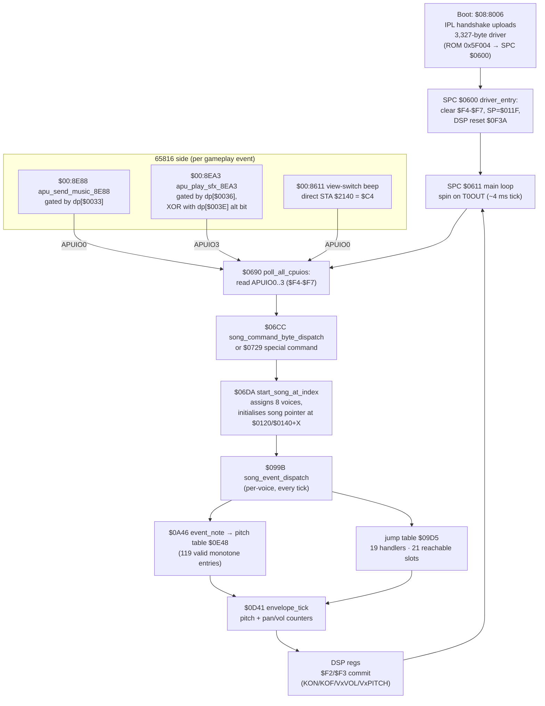

# 17 — Audio: SPC700 driver, music/SFX command surface, pitch + envelope

This page documents the SimAnt audio subsystem in full: the 3,327-byte
SPC700 driver that runs in the S-SMP coprocessor, the IPL handshake
that uploads it at boot, the two 65816-side "send command" entry
points that everything else goes through, every observed command byte
with its role, and the SPC-side pitch and envelope machinery.

None of this is in the manual. The manual (page 33, **Sound** options)
only documents the player-facing toggles: **Music ON/OFF** and **SFX
ON/OFF**. There is zero coverage of how sound is actually produced —
this page fills that gap.

For where the boot uploader is wired, see
[01 — Architecture](01-architecture.md) §2.

---

## 1. SPC700 binary — location, size, upload

The driver binary lives in ROM at **file offset `0x5F004`**, length
**3,327 bytes** (= `0x0CFF`). It loads into SPC ARAM `$0600..$12FE`.
The SPC entry PC after IPL is `$0600`.

> **Caveat.** Past lifts confused this binary with the 30 KB block at
> ROM offset `0x40A00`. That larger block is **music data** (song
> sequences, BRR samples, envelope tables — uploaded on demand via the
> `$FC` re-upload handshake). The actual code driver is the smaller
> 3,327-byte blob at `0x5F004`. Confirmed by entry-point analysis.

The uploader sits at `$08:8006` (lifted summary header at
`simant.c:971-981`). Earlier wiki drafts cited `simant.c:954-967`,
which is actually the asset-decompression / VRAM DMA helper —
unrelated to the SPC uploader.
It is the classic Nintendo IPL handshake — a 4-byte "ready?" exchange
on `APUIO0..APUIO3`, then a streaming loop where each 4-byte chunk is
packed into `A`/`X`/`Y` and gated by an `APUIO0` poll. Upload runs
**once at boot**, in force-blank, before NMI is enabled.

Boot-time SPC dp shadows (set by `simant.c:1024-1025` — earlier
drafts cited `simant.c:1007-1008`, which is `dp[$0A] = 0x81`
NMITIMEN setup, not the SPC shadows):

```
dp[$0033] = $01   ; music enable (master gate)
dp[$0034] = $01   ; SFX channel 1 enable
dp[$0035] = $01   ; SFX channel 2 enable
dp[$0036] = $01   ; SFX channel 3 enable
dp[$0037..$003A] = 0   ; per-channel current command bytes
```

---

## 2. SPC-side driver — `$0600` → `$0611` main loop

After IPL, the SPC700 jumps to `$0600`. The driver does:

```
$0600  driver_entry         CLRP, clear $F4-$F7, SP = $011F
                            CALL $0F3A (DSP + voice reset)
                            CALL $0611 (main loop, never returns)

$0611  main_loop            forever:
                              spin on T0OUT ($FD) for tick (~4 ms)
                              CALL $0670 (KON/KOF shadow reset)
                              CALL $0690 (poll APUIO commands)
                              CALL $0620 (commit shadow -> DSP)
```

**Tick rate**: timer 0 (T0DIV = `$80` against the 8 kHz internal
source) = **4 ms tick** = 250 ticks per second. The driver does one
mixer pass per tick. All envelope counters, pan-curve evaluation, and
song-stream decoding run at this rate.

Lifted entry: `audio_driver.c:315-326` (`driver_entry_0600`).
Main loop: `audio_driver.c:331+` (`driver_main_loop_0611`).

---

## 3. 65816 → SPC command surface

The game speaks to the SPC through **exactly two** subroutines plus a
single direct write. Every other audio call in the game funnels into
one of these.

### 3.1 `apu_send_music_8E88(cmd)` — `$00:8E88`

Music channel (`APUIO0`). Gated by `dp[$0033]` (the master Music
ON/OFF flag).

```c
/* lifted summary, see audio_intro.c:167-170 */
void apu_send_music_8E88(uint8_t cmd) {
    dp[0x0037] = cmd;
    if (dp[0x0033])
        APUIO0 = dp[0x0037];
}
```

### 3.2 `apu_play_sfx_8EA3(cmd)` — `$00:8EA3`

SFX channel (`APUIO3`). Gated by `dp[$0036]` (SFX ON/OFF). The XOR
alternation bit at `dp[$003E]` flips every call so the SPC700 can
detect "same SFX retriggered" vs "no new SFX" — without it, a
back-to-back identical SFX would look like a no-op to the polling
driver.

```c
/* audio_intro.c:172-178 */
void apu_play_sfx_8EA3(uint8_t cmd) {
    dp[0x003A] = cmd;
    if (dp[0x0036]) {
        dp[0x003E] = (dp[0x003E] + 1) & 0xFF;
        APUIO3 = (dp[0x003E] & 1) | cmd;
    }
}
```

### 3.3 Direct write — `play_sfx_and_fade_8611` (`$00:8611`)

Single ungated path. Writes `$C4` directly to `APUIO0`, bypassing the
Music gate, then runs the standard fade-out loop. Used **only** for
the view-switch confirmation beep. See `simant.c:762-766`.

---

## 4. Observed command bytes

Catalogue of every command byte the 65816 emits, with the SPC-side
handler each one selects. Verified by cross-referencing call sites in
`audio_intro.c:212-257` with the SPC dispatcher at `$06CC` /
`start_song_at_index_06DA` (see `audio_driver.c:1476-1499`).

### Music (APUIO0 — gated by `dp[$0033]`)

| Byte | Role |
|------|------|
| `$00` | silence (write 0 to all four APUIOs) |
| `$02` | encyclopedia / ant-info / credits BGM |
| `$04` | Black-nest overview BGM |
| `$06` | Red-nest overview BGM |
| `$08` | main-menu / title BGM |
| `$0C` | Black-nest close-up interior BGM |
| `$0E` | Red-nest close-up interior BGM |
| `$16` | surface-overview BGM |
| `$30` | pause-overlay music |

### SFX (APUIO3 — gated by `dp[$0036]`, XOR'd with retrigger bit)

| Byte | Role |
|------|------|
| `$2B` | queen "lay egg" SFX |
| `$2C` | control-panel "click" / "dig start" |
| `$2E` | menu-open / icon-popup |
| `$44` | yellow-ant "pickup" |
| `$4E` | "ouch / munch" (collision, eating) |
| `$4F` | trophallaxis ("feed from nestmate") |

### Direct writes / control codes

| Byte | Role |
|------|------|
| `$C4` | view-switch confirmation beep (direct `STA $2140`) |
| `$C8` | "dig new nest" confirmation SFX |
| `$FC` | (internal) 65816 asks SPC to re-upload music data |

---

## 5. SPC song dispatcher — `$099B` (the 19/21 discrepancy)

`song_event_dispatch_099B` reads the next byte of the per-voice song
stream and branches by class:

- High bit set (`& $80`) → `event_note_0A46` (pitch + duration).
- Otherwise mask `& $7F`. Range-check `>= $15` → kill track.
- Otherwise jump-table at `$09D5` indexed by `evt*2`.

The jump table has slots reachable by indices `0..20` (because the
range check is `>= $15`), but only the **first 19** point to real
handlers. Indices `19` and `20` land in the **body** of
`compute_pitch_09FF` and would execute garbage if a song stream ever
emitted them — but no SimAnt song ever does. This was confirmed in
the final cleanup pass (see `FINAL_CLEANUP.md`).

- **19 valid handlers** (`event_set_instr`, `event_pan`,
  `event_keypress`, `event_pitch_env`, `event_vol_env`, …).
- **21 reachable slots** through the range check.

Lifted with explicit comment: `audio_driver.c:1055-1067`. The lift
maps cases `5..18` to a kill-track recovery path until the remaining
handler bodies (at `$0AD2`, `$0ADA`, `$0AE6`, …) are individually
hand-translated.

---

## 6. SPC envelope tick — `$0D41`

Each tick, for each voice, two parallel phase counters advance:

```
Pitch envelope:  $B0+X (counter), $D0+X (phase index)
                 wraps via tables $12ED+Y / $12FC+Y
                 sampled at $1055+y*2 -> base ptr, + counter offset
Pan/vol env:     $70+X (counter), $90+X (phase index)
                 wraps via tables $12E1+Y / $12F0+Y
                 sampled at $103D+y*2 -> base ptr, + counter offset
```

Each phase has its own (start, end, curve-base) triple. The current
sample is sign-extended into `$07:$08` and committed to the DSP via
`pitch_to_dsp_or_noise_0E07` (pitch) and `apply_pan_to_dsp_0DE0`
(pan/vol). Lifted at `audio_driver.c:1565-1607`.

Gating:

- `dp[$0140+X] == 0` → voice is dead, skip entirely (this gate was
  missing in early lifts; the actual `if (spc_ram[0x0140 + x] == 0)
  return;` gate is at `audio_driver.c:1582-1586` — earlier drafts
  cited `audio_driver.c:1568-1572`, which is actually the "SPC700 not
  65816" documentation comment, not the gate itself).
- `dp[$04] & $02` → "done this frame" flag, also skip.

---

## 7. SPC pitch table — `$0E48` (119 valid monotone entries)

The pitch lookup at SPC `$0E48` should hold one 16-bit pitch value per
semitone. The compute-pitch routine `$09FF` reads pitch[note] and
pitch[note+1] to interpolate, so accessing note `n` actually touches
bytes `[0E48+n*2 .. 0E48+n*2+3]`.

The ROM clamps the note byte to `0..120` (via `MOV A, #$78` at
`$0A0C`), so 121 entries are reachable in principle. But only **119**
entries (note 0 through note 118) are actually monotone-increasing
proper pitch values:

- Note 0  -> `$0024`
- Note 118 -> `$7FFF` (one byte before `$0F36`)
- Note 119+ bytes (`$0F36` onward) are non-monotonic ROM bleed-through
  (`$00E8`, `$0CC4`, …) — almost certainly bytes belonging to whatever
  data structure follows in ROM.

Songs never address notes that high; if one ever did, pitch
interpolation would jump backward and produce a bug-class glitch
("garbage octave"). This is the kind of original-ROM quirk a
faithful port (or TCRF write-up) needs to know about. See verification
notes at `audio_driver.c:1113-1124`.

---

## 8. Audio pipeline diagram



---

## 9. Inline pointers

Code annotations referencing this page:

- `audio_driver.c:driver_entry_0600` (`audio_driver.c:315`) — "See
  wiki/17-audio.md §2 for the SPC main loop"
- `audio_driver.c:song_event_dispatch_099B` (`audio_driver.c:1032`) —
  "See wiki/17-audio.md §5 (19 valid handlers, 21 reachable slots)"
- `simant.c:sub_8611` view-switch beep (`simant.c:762`) — "See
  wiki/17-audio.md §3.3 for the direct $C4 write path"

---

## 10. Manual references

- **Page 33 — Sound options**: the player-facing toggles are Music
  ON/OFF and SFX ON/OFF. The manual says nothing about the SPC
  driver, the command surface, the per-channel SFX alternation bit,
  the song-byte dispatcher, the pitch table, or the envelope tick.
- The two manual toggles map directly to `dp[$0033]` and
  `dp[$0036]`. See [save_options.c:733-810](../save_options.c) for the
  sound-submenu UI flow (which the manual also does not document
  beyond "press SOUND in the options menu").

What the manual does NOT say but the code reveals:

- "Music OFF" is implemented as **silencing the APUIO0 write** — the
  SPC driver keeps running and timer 0 keeps ticking. There is no
  power-down path.
- The view-switch "beep" is structurally distinct from every other
  SFX — it bypasses the SFX gate and writes `APUIO0` directly. It is
  the only way the player hears any sound when SFX is disabled.
- Pitches above the 119th semitone are ROM garbage; the engine
  carefully clamps to 120 so songs never reach them. This is an
  artefact of the original SimAnt's data layout, not a bug.
