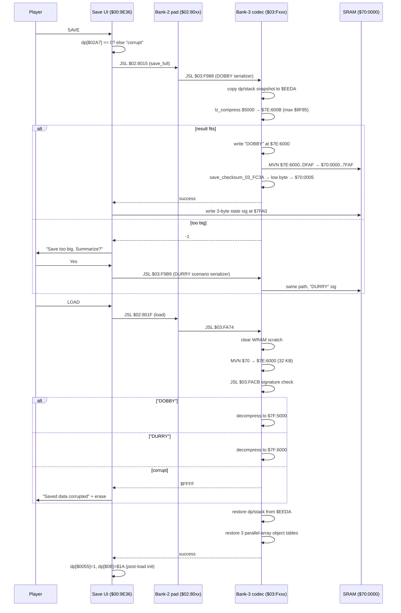

# 18 — Save / Load: SRAM layout, DOBBY/DURRY signatures, checksum, erase

This page documents SimAnt's save subsystem byte-for-byte: the SRAM
layout, the two save-format signatures (with their developer-in-joke
names), the 16-bit checksum, the developer signature, the four
scenario-slot table, the LZSS-compressed body format, and every entry
point in the save / load / erase chain.

Manual references: **page 5** ("Saved Games" intro) and **page 28**
("Loading a Saved Game"). The manual tells the player how to interact
with save slots — it does not tell them about DOBBY, DURRY, TOMCAT
SYSTEM, the 16-bit checksum, the dual compressor variants, or the
parallel-array object-table restore. All of that is below.

---

## 1. SRAM map — `$70:0000..$70:7FFF` (32 KB)

The cart has 32 KB of battery-backed SRAM at bank `$70`. The layout is
fixed regardless of save mode:

```
$70:0000-0007   Header (8 bytes — NOT included in the checksum)
  $00            save-type byte  (0 = none, 1 = full, 2 = scenario summarized)
  $01-02         serializer state (init context, recompacted at save time)
  $03-04         reserved / version
  $05-06         16-bit checksum of $70:0008..$70:7F9D (only low byte stored)
  $07            slot index / scenario-level marker

$70:0008-7F9F   LZSS-compressed save body (max ~32 KB)
                Body header:
                  bytes 0..4   signature: "DOBBY" or "DURRY"
                  bytes 5..6   reserved
                  bytes 7..8   uncompressed length (LE)
                  bytes 9..10  compressed length (LE)
                  bytes 11..   LZSS bitstream proper

$70:7FA0-7FA2   3-byte game-state signature (written by save_signature_write_AA2E):
                  $7FA0  dp[$02ED]  game-state code
                  $7FA1  dp[$0004]  clock hours
                  $7FA2  dp[$0003]  clock minutes

$70:7FB0-7FBF   16-byte developer signature: "TOMCAT SYSTEM   "
                (validated at boot; restored from ROM $01:9893 if corrupt)

$70:7FC0-7FFF   4 × 16-byte scenario-save slots
                slot N = $7FC0 + N*16, N ∈ 0..3
                First 4 bytes of a slot nonzero ⇒ slot occupied.
```

Lifted constants: `save_options.c:181-185`.

---

## 2. The "DOBBY" / "DURRY" signatures (developer in-jokes)

The 5-byte signature at the head of the compressed body identifies
which compressor variant produced the data:

```c
/* save_options.c:171-172 */
static const uint8_t SAVE_SIG_DOBBY[5] = { 'D','O','B','B','Y' };  /* full game        */
static const uint8_t SAVE_SIG_DURRY[5] = { 'D','U','R','R','Y' };  /* scenario "summarize" */
```

**These appear to be developer in-jokes** (TCRF candidates). They live
verbatim in ROM at `$03:F97E` ("DOBBY") and `$03:F983` ("DURRY"), and
are written into the staging buffer just before the SRAM bulk-copy.
The dual-name design is functional — they let the loader pick the
correct decompressor branch — but the choice of "DOBBY" / "DURRY" over,
say, "FULL0" / "SCEN1" is pure developer fingerprint.

The two variants differ in **staging-buffer base** and **maximum
output length**, not in the bitstream codec itself (both use the LZSS
variant at `$03:8000` / `$03:8467`):

| Signature | Staging base (WRAM) | Max length | Used by |
|-----------|---------------------|------------|---------|
| `DOBBY`   | `$7E:5000`          | `$9F85`    | full-game save |
| `DURRY`   | `$7E:6000`          | `$8F85`    | scenario "summarize" save (smaller — used when DOBBY exceeds SRAM) |

The two-tier retry is documented at `save_options.c:259-293`: if
`save_full_game_03_F988` returns `-1` ("data too big"), the UI
prompts "Save data is too big. Summarize? Yes/No". On Yes, the engine
re-runs the same compressor against the leaner `$6000` staging buffer
and writes a `DURRY` save instead.

---

## 3. The "TOMCAT SYSTEM" developer signature

A 16-byte developer signature sits at `$70:7FB0`:

```
T O M C A T   S Y S T E M       (3 trailing spaces, total 16 bytes)
```

Source: `save_options.c:175` and ROM `$01:9893..$98A2`.

This is **validated at every boot** by `sub_BC53`. If the SRAM copy
differs from the ROM copy (corruption, blank cart, hardware glitch),
the boot path restores it from ROM. The signature has no functional
relationship to save validity — it is the engine's way of detecting
"this SRAM has never seen our cart" so the very first boot on a fresh
cart can initialise the slot table.

"TOMCAT" is almost certainly a project codename — TCRF should
consider this alongside DOBBY/DURRY as part of the developer-in-joke
trio.

---

## 4. The 16-bit checksum — `$03:FC3A`

The checksum covers `$70:0008..$70:7F9D` (i.e. body + state signature
+ developer signature, but NOT the 8-byte header itself). It is a
plain 16-bit running sum of **16-bit little-endian words** with
wraparound, returned in `A`:

```c
/* save_options.c:389-397 — exactly the ROM body */
uint16_t save_checksum_03_FC3A(void)
{
    uint16_t sum = 0;
    for (unsigned i = 0x0008; i < 0x7F9E; i += 2)
        sum = (uint16_t)(sum + (sram[i] | (sram[i + 1] << 8)));
    return sum;
}
```

Although the routine computes 16 bits, **only the low byte is stored**
at `$70:0005`. That is the slot the SRAM header reserves for it. The
high byte is implicitly recomputed at validation time and compared
against the actual stored low byte — verifying both bytes would
require a 2-byte storage slot, and the header only allocates one.

> **V2-C correction note.** An earlier lift modelled the checksum as a
> byte-sum. It is a **word-sum** (16-bit), confirmed by the ROM
> assembly at `$03:FC3A`-`$03:FC4B` which sets `M=0` (16-bit
> accumulator) and uses `ADC $700000,x` followed by `INX INX`. The
> earlier byte-sum interpretation produced different totals for
> partially-corrupted saves and is no longer used. See
> `save_options.c:376-388` for the corrected derivation.

---

## 5. Save chain — three-bank dispatch

The save logic spans three ROM banks. The chain is:

```
$00:959D  save_game_959D                  (UI + save-game commit)
$00:9E36  save_ui_dispatch_9E36           (Save/Main-Menu prompt + retry)
   ↓ via the bank-2 trampoline pad at $02:8000:
$02:8015  save_full_entry                 → JSL $03:F988
$02:801A  save_scn_entry                  → JSL $03:F9B9
$02:801F  load_entry                      → JSL $03:FA74

$03:F988  save_full_game_03_F988          (the real DOBBY serializer)
$03:F9B9  save_scenario_03_F9B9           (the real DURRY serializer)
$03:FA74  load_game_03_FA74               (the real loader)

$03:FACB  load_signature_check_03_FACB    (DOBBY/DURRY/corrupt arbiter)
$03:FC3A  save_checksum_03_FC3A           (16-bit word sum)
$03:8000  lz_compress                     (LZ encoder)
$03:8467  lz_decompress                   (LZ decoder, same one VRAM assets use)
```

Lifted entry summaries: `save_options.c:18-30`.

**Caller convention** for the bank-3 entries:

- `DBR = $7F` (push old, push `$7F`, pull bank)
- `D = $0200` (PEA `#$0200` / PLD)
- `M16, X16`
- Return value in `A`: 0 = success, `$FFFF` = error.

---

## 6. Save signature check — `$03:FACB`

Three-way: full save / scenario save / corrupt.

```c
/* save_options.c:507-524 */
int16_t load_signature_check_03_FACB(void)
{
    /* compare $7E:6000..$6004 against "DOBBY" -> return 0 (full) */
    /* compare $7E:6000..$6004 against "DURRY" -> return 1 (scenario) */
    /* otherwise -> return -1 (corrupt, displayed as $FFFF to caller) */
}
```

The bulk SRAM-to-WRAM copy that lands data at `$7E:6000` runs
**before** the signature check, so the check operates on freshly
loaded data and is the canonical "is this slot valid?" oracle. Any
slot whose first 5 bytes do not match either signature triggers the
"Saved data corrupted" dialog and erase.

---

## 7. Load path — `$03:FA74`

```
1. Clear WRAM scratch ($7E:0000..1FFF, $2000..2FFF, $3000..3FFF, $4000..5FFF).
2. MVN $7E,$70 length $7000  — bulk-copy SRAM to WRAM staging at $7E:6000.
3. JSL $03:FACB — signature check (DOBBY → 0, DURRY → 1, else → $FFFF).
4. Set up the LZSS decompressor: source bank $7E, source addr $6007,
   destination bank $7F, destination = $5000 (DOBBY) or $6000 (DURRY).
5. JSL $03:836A — decompress the body.
6. Restore the dp/stack snapshot: copy $7E:EEDA..EE84 to $0200..02AA.
7. Restore three parallel-arrays object tables (B-ant, R-ant, Danger):
     Table 1: type at $CBB8, attr at $C3E8, x at $C000   (count: $E77E)
     Table 2: type at $D964, attr at $D57C, x at $D388   (count: $E780)
     Table 3: type at $E328, attr at $DF40, x at $DD4C   (count: $E782)
   Each entry with non-zero type is re-allocated via $02:F59F / $F5A8.
8. Clear sound/scent ticks ($F6D5 / $F6D3 = 0, 16-bit STZ).
9. Restore ant-count pointer ($EB5E → dp[$ED], $EB5C → dp[$EF]).
```

Lifted: `save_options.c:526-602` (`load_game_03_FA74_impl`).

---

## 8. Erase — `$00:9608` (full) / `$00:A986` (scenario slot)

**Full-save erase** (`save_options.c:715-723`): zero the first byte of
SRAM and the 3-byte state signature at `$7FA0`. This flips the
"save-type" byte at `$70:0000` to zero, which the menu code reads as
"slot empty".

**Scenario-slot erase** (`save_options.c:725-730`):

```c
void erase_scenario_slot_00_A986(uint8_t slot_index) {
    if (slot_index >= SRAM_NUM_SCN_SLOTS) return;
    unsigned base = SRAM_SCN_SLOTS_OFF + slot_index * SRAM_SLOT_SIZE;
    for (unsigned i = 0; i < 4; ++i) sram[base + i] = 0;
}
```

Only the first 4 bytes of the slot are cleared — the body (bytes
4..15) is intentionally preserved so a subsequent save into the same
slot can re-use ASCII label data. The "occupied" predicate
(`save_slot_is_occupied`) only checks bytes 0..3.

---

## 9. Save / load sequence diagram



---

## 10. Inline pointers

Code annotations referencing this page:

- `save_options.c:save_ui_dispatch_9E36` (`save_options.c:259`) — "See
  wiki/18-save-load.md §5 (the three-bank dispatch chain)"
- `save_options.c:save_checksum_03_FC3A` (`save_options.c:389`) — "See
  wiki/18-save-load.md §4 (16-bit word sum; low byte stored at
  $70:0005)"
- `save_options.c:load_signature_check_03_FACB` (`save_options.c:507`)
  — "See wiki/18-save-load.md §6 (DOBBY/DURRY/corrupt three-way)"

---

## 11. Manual references

- **Page 5 — "Saved Games"**: tells the player there is a saved-games
  feature and there are slots. Does not mention DOBBY/DURRY, the
  checksum, the developer signature, or the two-tier "Summarize"
  fallback.
- **Page 28 — "Loading a Saved Game"**: walks the player through the
  five-slot menu (Full Game + Scenario 1..4) and the "Are you sure?"
  confirm. The menu builder is `$00:9517`; see `save_options.c:611+`.

What the manual does NOT say but the code reveals:

- **DOBBY / DURRY developer in-jokes.** These two 5-byte signatures
  are the save-format magic numbers. Their playful names (vs. neutral
  alternatives like `FULL\0` / `SCN\0\0`) are pure developer
  fingerprint and should be catalogued by TCRF.
- **"TOMCAT SYSTEM"** developer signature at `$70:7FB0` — a project
  codename baked into every cart's SRAM. Auto-restored from ROM at
  boot; never user-visible.
- **Two-tier save retry.** If the full state does not compress under
  `~40 KB`, the engine silently offers to save a smaller "Summarize"
  snapshot instead (a scenario-mode save). The manual only describes
  the "Save Game empty / Save successful" success states.
- **The checksum is 16-bit word sum, low-byte-stored.** The single
  byte at `$70:0005` is enough to detect random bit-flips in the
  body. The engine does not store the high byte.
